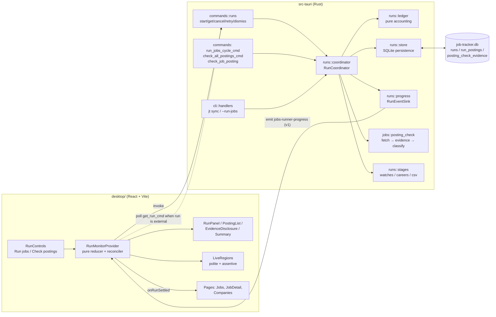
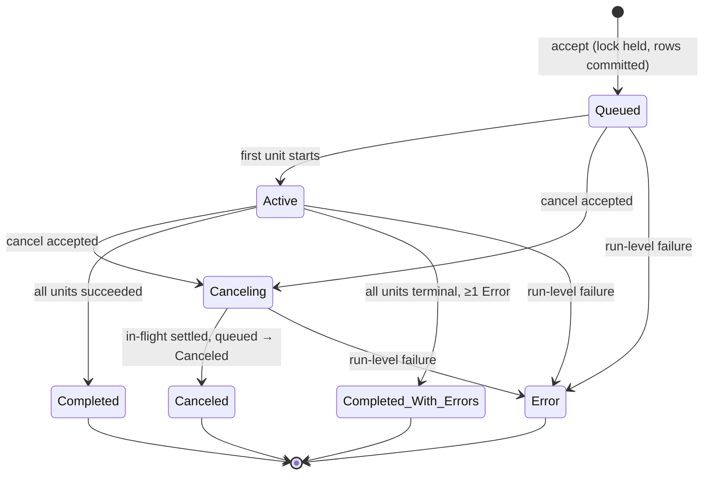
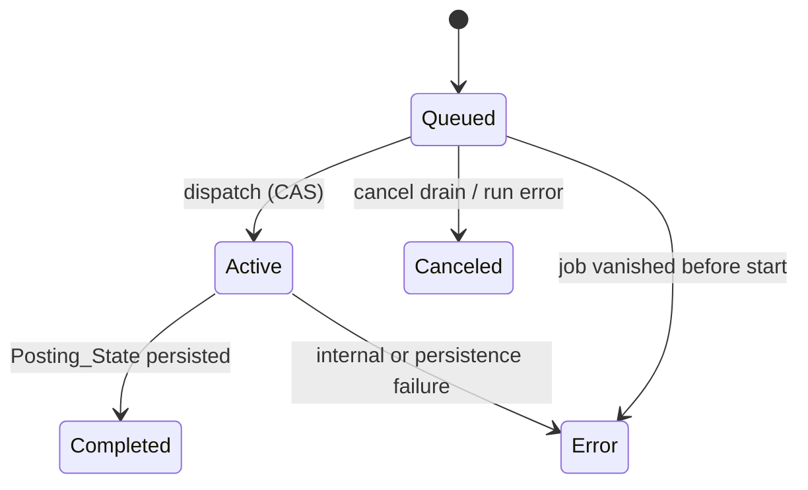
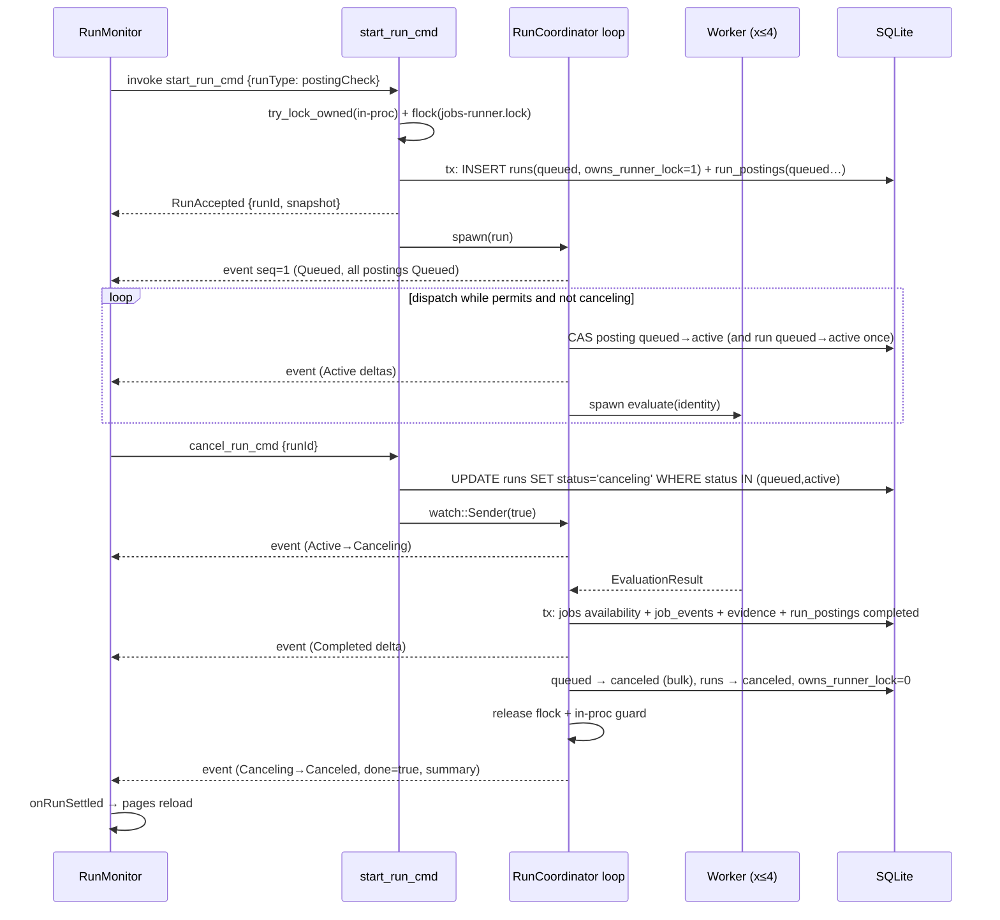
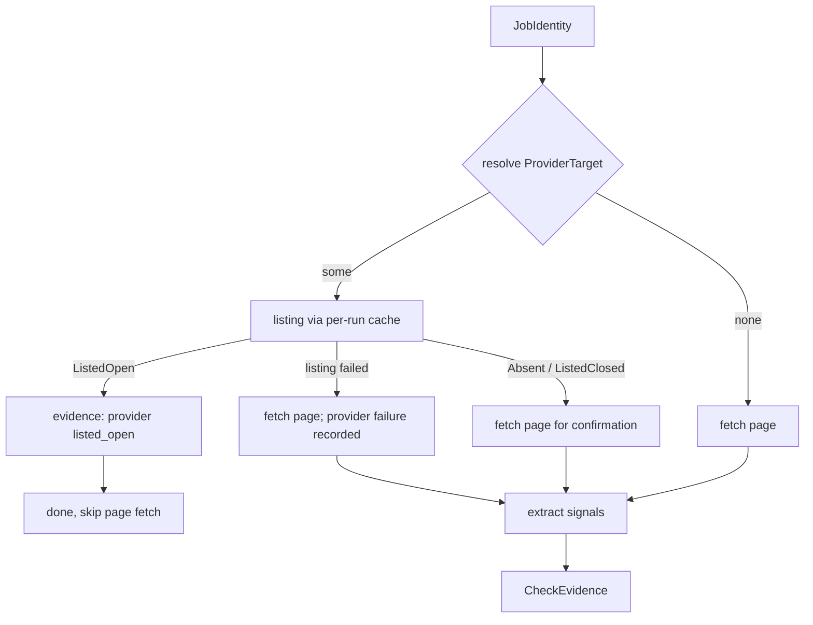

# Design Document: Job Check Run Visibility

## Overview

This design replaces the ad-hoc `runner.rs` loop and the two independent frontend progress listeners with a single **Run model** that is owned by a Rust `RunCoordinator`, persisted in SQLite, published through one versioned Tauri event, and rendered by one app-level `RunMonitor` in the React UI. It also replaces the "HTTP 2xx ⇒ active" posting check with an evidence-based `ClassificationEngine` that only reports Active or Closed when the evidence is conclusive.

### What the current code does (audit findings)

These findings come from reading `src-tauri/src/runner.rs`, `src-tauri/src/jobs/check_active.rs`, `src-tauri/src/jobs/safe_fetch.rs`, `src-tauri/src/commands/mod.rs`, `src-tauri/src/cli/`, `desktop/src/components/RunJobsButton.tsx`, and `desktop/src/pages/JobsPage.tsx`.

| # | Finding | Location | Impact |
|---|---------|----------|--------|
| A1 | `fetch_posting_state` returns `active` for any 2xx response that lacks one of six closure phrases. Redirects to a generic careers page, consent walls, login pages, and bot challenges that return 200 all become `active`. | `jobs/check_active.rs` | Main accuracy defect (Req 6). |
| A2 | Watch-sourced jobs (`source` ∈ greenhouse/lever/ashby with `source_external_id`) are checked by scraping HTML even though an authoritative provider listing exists (`ats::list_jobs`). | `runner.rs`, `ats/mod.rs` | Missed conclusive evidence (Req 6.1, 6.4). |
| A3 | `assert_public_hostname` calls the blocking `dns_lookup::lookup_host` inside an `async fn`. It blocks a Tokio worker and is not bounded by `tokio::time::timeout`. | `jobs/safe_fetch.rs` | Can stall a run past the 30 s bound (Req 8.1). |
| A4 | Rust emits `RunnerProgress { stage, message, current, total, done }`, but the TS type `JobsRunnerProgress` declares `phase`. The UI only reads `message`, so the mismatch is silent. | `runner.rs`, `desktop/src/lib/api.ts` | Contract drift (Req 11.4). |
| A5 | Both `RunJobsButton` and `JobsPage` listen to `jobs-runner-progress` and filter only by a local `busyRef`. Events carry no run identity or run type. | desktop | Cross-talk, lost state on navigation (Req 2.4, 2.6, 11.10). |
| A6 | Progress messages identify postings by raw job id (`Checked {job_id}`), not title/company. | `runner.rs` | Req 3. |
| A7 | Progress is shown in a 3-second absolute-positioned tooltip; there is no live region, cancel, retry, summary, or evidence view. | desktop | Req 2, 5, 9, 12. |
| A8 | `run_jobs_cycle_cmd` / `check_all_postings_cmd` block until completion and return only a summary, so the UI cannot learn a run id before the run ends. | `commands/mod.rs` | Req 1, 2. |
| A9 | Any `apply_*` DB error (`?`) aborts the whole cycle; later stages never run and no partial accounting is reported. | `runner.rs` | Req 1.7, 9.3. |
| A10 | CLI errors are printed as `Error: …` on stderr; `--json` prints no machine-readable error payload. | `main.rs` | Req 10.13. |
| A11 | Runs launched by launchd or `jt sync` are invisible to the GUI (events are only emitted to an in-process `AppHandle`). | `runner.rs` | Req 2.5, 4.5. |

### Goals

- One canonical lifecycle (`Queued → Active → [Canceling →] terminal`) shared by Jobs_Cycle and Posting_Check_Run, persisted so the GUI can restore and observe runs started by any process (GUI, `jt`, launchd).
- Per-posting visibility with stable Job_Identity, bounded concurrency (4), cancellation, and targeted retry.
- Conservative classification driven by structured, sanitized Check_Evidence with a deterministic Classification_Reason.
- Zero breaking changes to `run_jobs_cycle_cmd`, `check_all_postings_cmd`, `check_job_posting`, `jt sync`, `--run-jobs`, the `operation_in_progress:runner` lock, data-dir precedence, and CSV mirror behavior.

### Non-goals

- No HTTP server, socket, MCP, or LLM. No new CLI subcommands (automation keeps using `jt sync --json`).
- No anti-bot evasion: the checker keeps an honest `JobTrackerLocal/1.0` user agent and reports challenges as Unknown.
- No JavaScript rendering of posting pages. JS-only pages without server-rendered identity become Unknown, by design.

### Research notes

- **Greenhouse Job Board API**: `GET boards-api.greenhouse.io/v1/boards/{board_token}/jobs` lists published jobs with a stable numeric `id` and `absolute_url`; only application POSTs need auth ([Greenhouse Job Board API](https://docs.greenhouse.io/job-board.html), [API docs source](https://github.com/grnhse/greenhouse-api-docs/blob/master/source/includes/job-board/_jobs.md)). Already parsed by `ats::parse_ats_jobs_from_json`.
- **Ashby public Job Postings API** returns all currently published postings for an organization ([Ashby Job Postings API](https://developers.ashbyhq.com/docs/public-job-posting-api)). Ashby also supports *unlisted* postings, which can be reachable by URL but absent from the listing ([jobPosting.update](https://developers.ashbyhq.com/reference/jobpostingupdate)). The design therefore confirms a provider "absent" signal against the posting page and treats a positive page as a conflict (Unknown) instead of Closed.
- **Lever** `GET api.lever.co/v0/postings/{site}?mode=json` returns a bare array with `id` and `hostedUrl` (already parsed). Provider response shapes differ (`title` vs `text`, wrapper vs array), which a public write-up on these APIs also notes ([dev.to comparison](https://dev.to/neverempty/greenhouse-lever-ashby-workable-4-job-apis-1-dangerous-bug-5b5h)).
- **Tauri 2 events** (`AppHandle::emit` → `listen`) are in-process only. That is why cross-process runs have to be observed through the database.
- **SQLite partial unique indexes** let the schema enforce "at most one lock-owning run" and "one authoritative result per run and job" directly.

Content from the sources above was rephrased for compliance with licensing restrictions.

## Architecture



### Key design decisions

1. **Database is the source of truth; events are notifications.** Every lifecycle and per-posting transition is committed to SQLite first, then applied to the in-memory `RunLedger`, then emitted. `get_run_cmd` rebuilds the same snapshot from the DB. This single rule gives restore-on-start (Req 2.5), missed-update reconciliation (Req 2.7, 11.11), and visibility of CLI/launchd runs (A11).
2. **Single-owner coordinator loop.** One async task owns the SQLite connection, the ledger, and the event sink. Workers do network I/O and pure classification only and send results back over an `mpsc` channel. The loop never shares mutable state, so results can finish in any order without races (Req 4.6, 4.7).
3. **Start is compare-and-set in the DB.** A posting moves to Active only through `UPDATE run_postings … WHERE status='queued' AND (SELECT status FROM runs WHERE id=?) IN ('queued','active')`. Once `cancel_run_cmd` commits `canceling`, no further posting can start, in this process or any other (Req 5.4).
4. **New async commands, legacy commands as thin adapters.** `start_run_cmd` returns a `RunAccepted` immediately. The existing blocking commands and the CLI call the same coordinator, await the terminal state, and project the result onto the legacy JSON shape (Req 10.2–10.6).
5. **Same event channel, versioned superset payload.** Keep the event name `jobs-runner-progress` and the fields `stage`, `message`, `current`, `total`, `done` (Req 11.6). Add `version`, `runId`, `runType`, `runStatus`, `seq`, and so on. A per-run monotonically increasing `seq` lets the frontend detect gaps.
6. **Provider-first classification.** When a posting maps to a Greenhouse, Lever, or Ashby board, fetch the board listing once per run (memoized) and use the stable id. Fall back to the page, or combine with it, only when the provider result is not positive.
7. **Blockers dominate.** Any transient, auth, consent, anti-bot, or access-denied signal forces Unknown, even when other positive or closed evidence exists (Req 6.6, 6.7, 6.10, 6.11, 6.14).
8. **Late results never mutate authoritative state.** After a 30 s timeout the posting is finalized as `Completed/Unknown(timeout)`. If the network task finishes within a bounded grace window, its evidence is stored as `kind='supplementary'` only (Req 8.8, 8.9).

### Run lifecycle state machine



Per-posting transitions (enforced by `RunLedger` and by conditional SQL):



### Sequence: desktop Posting_Check_Run with cancel



## Components and Interfaces

### Module layout (Rust)

```
src-tauri/src/
  runs/
    mod.rs            // re-exports; RunRegistry
    model.rs          // RunId, RunType, RunStatus, PostingStatus, StageName, StageOutcome, JobIdentity
    lifecycle.rs      // pure run-status transition function + terminal-status derivation
    ledger.rs         // pure RunLedger (per-posting status + counters)
    progress.rs       // Progress_Contract types, bounds, RunEventSink trait + impls
    store.rs          // SQLite persistence for runs / run_postings / evidence
    coordinator.rs    // RunCoordinator: accept, dispatch loop, cancel, retry, finalize
    stages/
      postings.rs     // posting stage (uses jobs::posting_check)
      watches.rs      // moved from runner.rs, unchanged semantics
      careers.rs      // moved from runner.rs, unchanged semantics
      csv.rs          // moved from runner.rs, unchanged semantics
    legacy.rs         // projection RunSnapshot → legacy JSON summaries
  jobs/
    posting_check/
      mod.rs
      evidence.rs     // CheckEvidence, signals, normalization, URL sanitization
      signals.rs      // HTML → ContentSignal extraction (scraper)
      provider.rs     // ProviderTarget resolution + per-run ProviderListingCache
      fetch.rs        // PostingFetcher trait + HttpPostingFetcher (uses safe_fetch)
      classify.rs     // pure classify(&CheckEvidence) -> Classification
      persist.rs      // apply_classified_check (jobs row + job_events + evidence), tx-only
    check_active.rs   // kept as a thin shim delegating to posting_check (check_job_posting)
    safe_fetch.rs     // + redirect chain, error kind, allowlisted signal headers, async DNS
  runner.rs           // kept: try_lock_runner, run_jobs_cli; functions delegate to runs::coordinator
  commands/runs.rs    // new Tauri commands
```

`runner::run_jobs_cycle`, `runner::check_all_postings`, and `runner::try_lock_runner` keep their signatures. `commands::sync_watch` and the CSV commands still call `try_lock_runner`, so their lock behavior does not change.

### Component 1: Run model and lifecycle (`runs::model`, `runs::lifecycle`)

```rust
#[derive(Debug, Clone, Copy, PartialEq, Eq, Hash, Serialize, Deserialize)]
#[serde(rename_all = "camelCase")]
pub enum RunType { JobsCycle, PostingCheck }

#[derive(Debug, Clone, Copy, PartialEq, Eq, Serialize, Deserialize)]
#[serde(rename_all = "snake_case")]
pub enum RunStatus { Queued, Active, Canceling, Canceled, Completed, CompletedWithErrors, Error }

impl RunStatus {
    pub fn is_terminal(self) -> bool {
        matches!(self, Self::Canceled | Self::Completed | Self::CompletedWithErrors | Self::Error)
    }
}

pub enum RunEvent { FirstUnitStarted, CancelAccepted, AllUnitsSettled { any_error: bool }, RunFailed }

/// Pure transition function. Returns Err for any transition not in the state diagram.
pub fn next_status(current: RunStatus, event: RunEvent) -> Result<RunStatus, LifecycleError>;
```

`AllUnitsSettled` resolves to `Canceled` when `current == Canceling`, to `CompletedWithErrors` when `any_error`, and to `Completed` otherwise (Req 1.5, 1.6, 5.6). Terminal statuses reject every event (Req 1.4, 5.11).

### Component 2: RunLedger (`runs::ledger`)

A pure, in-memory mirror of `run_postings` for one run. It is used for event deltas and as the model in property tests.

```rust
pub struct RunLedger {
    entries: Vec<PostingEntry>,          // stable ordinal order
    index: HashMap<String, usize>,       // job_id -> entry (Req 3.10)
    counts: PostingCounts,               // queued, active, completed, error, canceled
}

impl RunLedger {
    pub fn new(identities: Vec<JobIdentity>) -> Result<Self, LedgerError>; // rejects duplicate job ids
    pub fn transition(&mut self, job_id: &str, to: PostingStatus, detail: TransitionDetail)
        -> Result<PostingDelta, LedgerError>;
    pub fn counts(&self) -> PostingCounts;           // sum == total always (Req 3.11, 8.4)
    pub fn queued_ids(&self) -> impl Iterator<Item = &str>;
    pub fn snapshot(&self) -> Vec<PostingProgress>;
}
```

Allowed transitions are `Queued→Active`, `Queued→Canceled`, `Queued→Error`, `Active→Completed`, and `Active→Error`. Any other request returns `LedgerError::IllegalTransition` and leaves the ledger unchanged. Because terminal entries are immutable, counters move exactly once per terminal transition (Req 8.6), and an Error can never be followed by Completed for the same attempt (Req 3.5).

### Component 3: Progress contract and event sinks (`runs::progress`)

```rust
pub const PROGRESS_CONTRACT_VERSION: u32 = 1;
pub const EVENT_NAME: &str = "jobs-runner-progress";   // unchanged channel

pub trait RunEventSink: Send + Sync {
    fn publish(&self, event: &RunProgressEvent);
}
pub struct TauriSink(AppHandle);        // app.emit(EVENT_NAME, event)
pub struct LogSink;                     // log::info! line, the current CLI/launchd behavior
pub struct RecordingSink(Mutex<Vec<RunProgressEvent>>); // tests
```

All strings pass through `bounded(s, MAX)` before construction. It truncates on a UTF-8 char boundary and appends `…`, so events can never exceed the bounds (Req 11.2). Counts are `u64` constructed through `BoundedCount::new(v)`, which saturates at `2^53 − 1` (Req 11.3). The exact fields are in [Data Models](#progress-contract-v1).

### Component 4: RunStore (`runs::store`)

This component holds all SQL for the new tables. Every public function takes `&Connection` and runs inside a caller-supplied transaction when atomicity is required.

```rust
pub fn insert_accepted_run(tx: &Connection, run: &NewRun, postings: &[JobIdentityWithState]) -> AppResult<()>;
pub fn cas_run_status(tx: &Connection, run_id: &str, from: &[RunStatus], to: RunStatus) -> AppResult<bool>;
pub fn try_mark_posting_active(tx: &Connection, run_id: &str, job_id: &str, at: &str) -> AppResult<bool>;
pub fn finalize_posting(tx: &Connection, run_id: &str, result: &FinalizedPosting) -> AppResult<()>;
pub fn mark_posting_error(conn: &Connection, run_id: &str, job_id: &str, category: FailureCategory, reason: &str) -> AppResult<()>;
pub fn cancel_remaining_queued(tx: &Connection, run_id: &str, at: &str) -> AppResult<Vec<String>>;
pub fn request_cancel(conn: &Connection, run_id: &str, at: &str) -> AppResult<CancelOutcome>;
pub fn finalize_run(tx: &Connection, run_id: &str, terminal: &TerminalRecord) -> AppResult<()>; // clears owns_runner_lock
pub fn load_snapshot(conn: &Connection, run_id: &str) -> AppResult<Option<RunSnapshot>>;
pub fn load_current(conn: &Connection) -> AppResult<Option<RunSnapshot>>; // non-terminal, else latest undismissed terminal
pub fn recover_orphaned_runs(conn: &Connection, at: &str) -> AppResult<usize>;
pub fn insert_supplementary_evidence(conn: &Connection, run_id: &str, job_id: &str, ev: &CheckEvidence) -> AppResult<()>;
pub fn prune_history(conn: &Connection, keep_runs: usize, keep_evidence_per_job: usize) -> AppResult<()>;
```

### Component 5: RunCoordinator (`runs::coordinator`)

```rust
pub struct RunCoordinator<F: PostingFetcher, S: RunEventSink, K: Clock> {
    paths: DataPaths, fetcher: Arc<F>, sink: Arc<S>, clock: K, registry: RunRegistry,
    config: RunConfig, // posting_concurrency = 4, eval_timeout = 30s, late_grace = 15s, cancel_poll = 250ms
}

impl<F, S, K> RunCoordinator<F, S, K> {
    /// Acquire both locks, validate, and commit the accepted run. No DB mutation happens before both
    /// locks are held; any failure before commit releases the locks and mutates nothing.
    pub async fn accept(&self, req: RunRequest) -> Result<AcceptedRun, RunRejection>;
    /// Drive an accepted run to a terminal state. Always releases the locks (RAII guard).
    pub async fn execute(&self, run: AcceptedRun) -> RunSnapshot;
    pub fn cancel(&self, conn: &Connection, run_id: &str) -> Result<RunSnapshot, RunRejection>;
}

pub enum RunRequest {
    JobsCycle { trigger: Trigger },
    PostingCheck { trigger: Trigger },
    Retry { source_run_id: String, job_ids: Vec<String>, trigger: Trigger },
}
```

**Lock ownership.** `AcceptedRun` holds a `RunLockGuard { in_proc: OwnedMutexGuard<()>, file: std::fs::File }`. Its `Drop` implementation unlocks the flock, so the lock is released on every terminal path, including panics unwinding through `execute` (Req 4.9). The `runs.owns_runner_lock` column is set in the accept transaction and cleared in `finalize_run`. A partial unique index guarantees at most one row owns the lock (Req 4.8).

**Accept algorithm** (Req 1.1, 1.2, 3.9, 4.3, 4.4, 5.9, 5.12, 10.15):

1. `runner_lock.clone().try_lock_owned()` fails → `RunRejection::InProgress` (`operation_in_progress:runner`).
2. `try_lock_runner(&paths)` fails → drop the in-process guard, then return `InProgress`.
3. Open the runner connection (existing `open_runner_conn`), then call `recover_orphaned_runs` (safe because this process now holds the flock).
4. Build the posting set: `SELECT j.id, j.title, c.name, j.url, j.posting_state FROM jobs j JOIN companies c … ORDER BY c.name COLLATE NOCASE, j.title COLLATE NOCASE, j.id`. This is the same job set the current loop checks (all jobs), in a stable display order. For Retry, validate each id against the source run: it must exist, the source run must be terminal, the entry must be `status IN ('error','canceled')` or `posting_state='unknown'`, and the job must still exist. Deduplicate while preserving first-seen order. An empty or invalid selection returns `RunRejection::RetryIneligible { job_ids }` with no writes.
5. Run one transaction: `insert_accepted_run` (status `queued`, `started_at = accepted_at = clock.now()`, `owns_runner_lock = 1`, `last_seq = 1`) plus all `run_postings` rows as `queued` with frozen Job_Identity and `state_at_start`. The commit is the **accept point**.
6. Publish `seq=1` (Queued, full posting list, counters, stages all `not_started`).

**Dispatch loop** (single task, `tokio::select!`):

```
state: ledger, in_flight = 0, late_in_flight = 0, canceling = false
loop {
  select! {
    permit = semaphore.acquire_owned(), if !canceling && ledger.has_queued() => {
        let next = ledger.next_queued();
        if !store.try_mark_posting_active(run, next)? { canceling = true; drop(permit); continue }  // CAS lost to cancel
        if first_start { cas_run_status(run, [Queued], Active); publish(Queued→Active) }        // Req 1.3
        ledger.transition(next, Active); publish(delta)                                          // Req 3.2
        spawn_worker(next.identity, permit, provider_cache.clone(), tx.clone()); in_flight += 1
    }
    Some(msg) = rx.recv() => match msg {
        Authoritative { job_id, evidence } => { finalize (tx) → Completed | Error; in_flight -= 1 }
        WorkerFailed { job_id, category } => { mark_posting_error; in_flight -= 1 }
        Supplementary { job_id, evidence } => { insert_supplementary_evidence; late_in_flight -= 1 } // Req 8.8, 8.9
        LateStarted => late_in_flight += 1,
    },
    _ = cancel_rx.changed() => { canceling = true; publish(→Canceling) }                         // in-process
    _ = poll.tick() => if store.run_status(run)? == Canceling && !canceling { canceling = true; publish(...) } // cross-process
  }
  if in_flight == 0 && (canceling || !ledger.has_queued()) { break }
}
if canceling { abort late tasks; for id in store.cancel_remaining_queued(run) { ledger.transition(id, Canceled) } }  // Req 5.5
else { await late tasks until grace deadline, then abort }
```

The semaphore has 4 permits (Req 4.1). Each worker holds its permit until its network task finishes or the late-grace deadline passes, so overlapping late tasks still count against the limit. Because `run_postings` has primary key `(run_id, job_id)` and the ledger rejects `Active→Active`, one Job_Identifier can never have two active checks in a run (Req 4.2).

**Worker** (no DB access):

```rust
async fn worker(identity: JobIdentity, _permit: OwnedSemaphorePermit, fetcher: Arc<impl PostingFetcher>,
                cache: ProviderListingCache, tx: mpsc::Sender<WorkerMsg>, cfg: RunConfig) {
    let attempted_at = clock.now();
    let mut handle = tokio::spawn(evaluate(identity.clone(), fetcher, cache, attempted_at));
    match tokio::time::timeout(cfg.eval_timeout, &mut handle).await {
        Ok(Ok(evidence)) => tx.send(Authoritative { evidence }).await,
        Ok(Err(join_err)) => tx.send(WorkerFailed { category: FailureCategory::Internal, .. }).await,
        Err(_elapsed) => {
            tx.send(Authoritative { evidence: CheckEvidence::timeout(&identity, attempted_at) }).await; // Req 8.2
            tx.send(LateStarted).await;
            match tokio::time::timeout(cfg.late_grace, handle).await {
                Ok(Ok(late)) => tx.send(Supplementary { evidence: late }).await,
                _ => tx.send(LateAbandoned).await, // handle dropped → aborted
            }
        }
    }
}
```

**Finalize posting** (Req 3.3, 3.4, 6.17, 7.1, 7.8, 7.10, 8.7) runs in one `BEGIN IMMEDIATE` transaction:

1. `classification = classify(&evidence.normalized())` (pure).
2. `UPDATE jobs SET posting_state=?, last_checked_at=?attempted_at, last_check_result=?, updated_at=? WHERE id=?`. Only availability columns change. Zero affected rows → `FailureCategory::Persistence("job_missing")`.
3. If the persisted state differs from the job's current `posting_state`, insert exactly one `job_events` row of type `posting_state_changed`. The note contains the previous state, new state, and Classification_Reason. `occurred_at` is the change time.
4. Insert the authoritative `posting_check_evidence` row.
5. `UPDATE run_postings SET status='completed', posting_state=?, reason_code=?, reason=?, attempted_at=?, finished_at=?`.

On any error the transaction rolls back and `mark_posting_error(category = Persistence)` runs in a fresh statement. If that also fails, the run moves to `Error` with reason `persistence_unavailable` (Req 1.7).

**Run finalization.** Derive the terminal status with `lifecycle::next_status`. For Jobs_Cycle, `any_error` = any posting `error` ∨ any stage `failed`. Then `finalize_run` records `finished_at`, `duration_ms = finished_at − started_at` (Req 1.8), `summary_json`, and `owns_runner_lock = 0`. The lock is dropped next, and the terminal event (`done=true`) is published last. `prune_history` runs best-effort after finalization.

**Run-level failure** (Req 1.7). A failure that prevents continuing (for example the runner connection becomes unusable, a stage cannot read its inputs, or the ledger and DB disagree) marks queued postings `canceled` and in-flight postings `error` (category `run_aborted`). Already-finalized rows are left untouched. The run is set to `Error` with a non-empty `error_reason`. All of this is best-effort persisted, and the terminal event is published even if persistence fails.

**Orphan recovery.** A non-terminal `runs` row whose owner process died (for example the app quit mid-run or launchd was killed) is found by `recover_orphaned_runs`. It is only called while this process holds the flock, which proves no other process owns the run. The row is set to `Error` with reason `runner_interrupted`, and its postings are closed out as above. `get_current_run_cmd` also calls it opportunistically when both locks can be acquired and released immediately.

### Component 6: Jobs_Cycle stages (`runs::stages`)

Stages run in the fixed order `postings → watches → careers → csv`. Each stage starts only if the run is not canceling. Each stage records `StageProgress { name, outcome, current, total, startedAt?, finishedAt?, error? }`.

| Stage | Units | Concurrency / timeout | `failed` when |
|-------|-------|-----------------------|---------------|
| postings | run_postings entries | 4 / 30 s | never at stage level; posting errors count as unit errors |
| watches | `company_watches` rows | 2 / 30 s (unchanged) | `apply_watch_sync` returns `Err` (DB failure). Provider fetch failures stay item-level results as today |
| careers | companies with `careers_url` | 4 / 30 s (unchanged) | `apply_careers_check` returns `Err` |
| csv | 1 | n/a | `sync_jobs_csv_with_disk` returns `Err` |

A stage failure is recorded and the next stage still runs. This fixes A9 and keeps later stages (especially CSV) running. At the terminal state, every stage that never started is `skipped`, so no stage is left `not_started` or `in_progress` (Req 2.2, 9.3, 9.4). When canceled, the remaining stages are `skipped`. The CSV stage is skipped too; when the run executes inside the GUI process, `csv_export.mark_dirty()` is called so the mirror still catches up (Req 10.10).

A Posting_Check_Run has only the `postings` stage. When it runs in the GUI process and at least one `posting_state` changed, it calls `csv_export.mark_dirty()`, matching `check_job_posting` today. From the CLI it keeps the current behavior: no CSV write outside Jobs_Cycle.

### Component 7: Posting check pipeline (`jobs::posting_check`)

```rust
pub trait PostingFetcher: Send + Sync + 'static {
    fn fetch_page(&self, url: &str) -> impl Future<Output = PageFetch> + Send;
    fn fetch_listing(&self, provider: Provider, slug: &str) -> impl Future<Output = ListingFetch> + Send;
}
pub struct HttpPostingFetcher; // safe_fetch + ats::parse_ats_jobs_from_json

pub async fn evaluate<F: PostingFetcher>(id: &JobIdentity, f: &F, cache: &ProviderListingCache, at: String) -> CheckEvidence;
pub fn classify(evidence: &CheckEvidence) -> Classification;   // pure, total, deterministic
pub fn extract_signals(html: &str, identity: &JobIdentity, requested: &Url, final_url: &Url) -> ContentSignals; // pure
```

**Evaluation flow:**



**ProviderTarget resolution** (pure, `provider.rs`):

1. If `jobs.source ∈ {greenhouse, lever, ashby}` and `source_external_id` is set, use that provider and posting id. The board slug comes from `discover_from_url(job.url)` when the provider matches, else from the job's company when it has exactly one `company_watches` row for that provider.
2. Otherwise, if `discover_from_url(job.url)` returns a `DetectedBoard` with a `posting_id`, use it. This lets manual jobs pasted from ATS URLs get provider evidence.
3. Otherwise there is no provider target.

`ProviderListingCache` is `Arc<Mutex<HashMap<(Provider, String), Arc<tokio::sync::OnceCell<ListingFetch>>>>>`, which gives one listing request per board per run.

**Page signal extraction** (`signals.rs`, `scraper`). The normalizer is `norm(s)`: lowercase, HTML-entity decoded, non-alphanumerics collapsed to single spaces, trimmed. Matching is token-bounded containment of `norm(needle)` in `norm(haystack)`.

| Signal | Rule (all inputs normalized) |
|--------|------------------------------|
| `title_match` | `norm(job.title)` appears in any *identity field*: `<title>`, `og:title`, first `<h1>`, JSON-LD `JobPosting.title`. The page body is deliberately excluded so a careers index that lists the title does not match. |
| `company_match` | `norm(company)` appears in JSON-LD `hiringOrganization.name`, non-ATS `og:site_name`, `<title>`, first `<h1>`, or equals the final host's registrable label or the ATS board slug with spaces removed. |
| `apply_enabled` | An `a`, `button`, or `input[type=submit]` whose text, `aria-label`, or `value` matches `\bapply\b` / `submit application` / `start application`, or whose `href` contains `/apply`, or a known ATS application form (`#application_form`, `#application-form`, `form[action*="apply"]`). It must not have `disabled`, `aria-disabled="true"`, or a `disabled` class token. |
| `apply_disabled` | The same control matched but disabled. Informational only. |
| `closure_copy` | The page contains one of the closure phrases (the existing six plus "no longer open", "no longer available", "job not found", "applications are closed", "this role has been filled", "posting has expired"). It counts as *matched to the posting* only if `title_match`, or if the final URL path equals the requested path (no cross-path redirect). |
| `consent_page` | The final host or path matches a consent pattern (`consent.`, `/consent`, `/privacy-gateway`, `/cookie`), or `<title>`/`<h1>` matches a consent phrase. Cookie *banners* inside a real posting page do not trigger it. |
| `auth_page` | The final path matches `/login`, `/signin`, `/sign-in`, `/sso`, `/oauth`, `/auth`, or the host starts with `accounts.`/`login.`; or `<title>` is a sign-in phrase; or `input[type=password]` is present without `title_match`. |
| `anti_bot` | Allowlisted header `cf-mitigated: challenge`, or `<title>` is "just a moment…" / "attention required" / contains "captcha", or challenge markers (`challenge-platform`, `_Incapsula_Resource`, `px-captcha`). |
| `access_denied` | `<title>`/`<h1>` matches "access denied", "forbidden", "you don't have permission". |
| `generic_careers` | The redirect changed the path to a listing-like path (`/careers`, `/jobs`, board root, or `?error=true`) and `title_match` is false; or the page has ≥ 3 distinct job-detail links and no `title_match`. |

Only signal *categories* are kept. Body text, excerpts, and headers other than the allowlisted signal header are discarded right after extraction (Req 7.4, 7.9).

**Classification** (`classify.rs`), the ordered decision procedure:

```
positive  = provider == ListedOpen
          ∨ (http ∈ 2xx ∧ title_match ∧ company_match ∧ apply_enabled)                   // 6.1, 6.2
closed    = final http ∈ {404, 410}                                                        // 6.3
          ∨ provider ∈ {ListedClosed, AbsentFromListing}  (listing retrieved and parsed)   // 6.4
          ∨ closure_copy_matched                                                           // 6.5
blockers  = transient failure (timeout, dns_timeout, connect, http 429, http 5xx, provider_temporary)
          ∪ http 401/403 ∪ {consent_page, auth_page, anti_bot, access_denied}              // 6.10, 6.11, 6.14

if blockers ≠ ∅            → Unknown, reason names every blocker category                  // 6.6/6.7 guards
else if positive ∧ closed  → Unknown, reason "conflict: <positive cats> vs <closed cats>"   // 6.8
else if positive           → Active                                                        // 6.6
else if closed             → Closed (persisted "inactive")                                 // 6.7
else                       → Unknown, reason "no conclusive evidence" (+ generic_careers,
                                                non-transient failure category if present) // 6.9, 6.12, 6.13
```

Redirects are classified on the final response and final URL. The requested URL, final URL, and redirect status codes are kept in the evidence (Req 6.12).

`Classification { state, reason_code, reason }`. `reason` is built only from the enum categories and HTTP status, in a fixed order, and is bounded to 500 bytes. That keeps it deterministic (Req 6.15, 6.16). Examples:

- `Open: listed on Greenhouse board (id 127817)`
- `Open: page matches title and company with an enabled Apply control (HTTP 200)`
- `Closed: posting returned HTTP 404`
- `Closed: absent from Lever listing`
- `Unknown: blocked by anti-bot challenge (HTTP 403)`
- `Unknown: timed out after 30s`
- `Unknown: conflicting evidence (provider listed open vs closure copy)`
- `Unknown: redirected to a generic careers page (HTTP 200)`

`jobs.last_check_result` stores `"{persisted_state}: {reason_detail}"`, where `reason_detail` is the reason without its `Open:`/`Closed:`/`Unknown:` label (for example `unknown: timed out after 30s`, `inactive: posting returned HTTP 404`). This keeps the existing `<state>: <detail>` convention that `checkResultNote` and CSV consumers read (Req 10.5).

### Component 8: safe_fetch changes (additive)

- `SafeFetchResult` gains `requested_url`, `redirect_statuses: Vec<u16>`, `error_kind: Option<FetchErrorKind>`, and `signal_headers: Vec<(String, String)>` (allowlist: `cf-mitigated`). Existing fields and their meanings are unchanged, so `ats`, `metadata`, and `careers` callers are unaffected.
- `FetchErrorKind` = `Timeout | Dns | DnsTimeout | Connect | BlockedDestination | InvalidUrl | RedirectMissingLocation | RedirectInvalid | TooManyRedirects | TooLarge | Body | Client`.
- DNS resolution moves to `tokio::task::spawn_blocking` wrapped in a 5 s `tokio::time::timeout`. This fixes A3: the worker thread is no longer blocked, and the 30 s bound is enforceable.
- The private-address checks and the scheme allowlist are unchanged.

### Component 9: Tauri commands (`commands/runs.rs`, registered in `lib.rs`)

| Command | Args | Returns | Errors (string codes) |
|---------|------|---------|-----------------------|
| `start_run_cmd` | `{ input: { runType: "jobsCycle" \| "postingCheck" } }` | `RunAccepted { runId, snapshot }` | `operation_in_progress:runner`, `run_start_failed:<category>` |
| `retry_run_cmd` | `{ input: { sourceRunId, jobIds: string[] } }` | `RunAccepted` | `operation_in_progress:runner`, `retry_ineligible:<detail>`, `run_not_found` |
| `cancel_run_cmd` | `{ runId }` | `RunSnapshot` (status `canceling`) | `cancel_not_allowed:<status>`, `run_not_found` |
| `get_run_cmd` | `{ runId }` | `RunSnapshot` | `run_not_found` |
| `get_current_run_cmd` | none | `RunSnapshot \| null` | none |
| `dismiss_run_cmd` | `{ runId }` | `{ ok: true }` | `run_not_found`, `dismiss_not_allowed:<status>` (non-terminal) |

`start_run_cmd` and `retry_run_cmd` call `coordinator.accept(...)`, register the cancel handle in `RunRegistry`, `tauri::async_runtime::spawn` the `execute` future, and return. `cancel_run_cmd` runs `store.request_cancel` on the AppState connection (a conditional `UPDATE … WHERE status IN ('queued','active')`), then signals the registry's `watch::Sender` if the run is in-process.

**Legacy commands** keep their names and return shapes:

- `run_jobs_cycle_cmd` → `accept(JobsCycle{trigger: LegacyCommand})` + `execute` → `legacy::jobs_cycle_summary(&snapshot)`.
- `check_all_postings_cmd` → the same with PostingCheck → `legacy::postings_summary`.
- `check_job_posting` → a single posting evaluation (not a Run, no runner lock, as today). It persists through `posting_check::persist` with `run_id = NULL` and returns `{ postingState, lastCheckResult, lastCheckedAt }`.

Legacy projection rules:

| Terminal status | Legacy result |
|-----------------|---------------|
| Completed / Completed_With_Errors | `Ok` with the existing fields (`postings` = number of completed posting results, `watches`, `careers`, `csv {imported, exported}`) plus additive `runId` and `runStatus` |
| Canceled | `Err("run_canceled:<runId>")` |
| Error | `Err("run_failed:<reason_code>")` |

These legacy commands also publish the v1 events, because they run through the same coordinator. The desktop UI stops calling them, but they remain for compatibility.

### Component 10: Structured errors (Rust and CLI)

```rust
pub enum AppError { …existing…, Coded { code: &'static str, category: String, message: String } }
// Display / Serialize for Coded => "{code}:{category}"   (so "operation_in_progress:runner" is byte-identical)
impl AppError { pub fn code_parts(&self) -> ErrorParts { code, category, message } } // parses legacy "a:b" strings too
```

In `main.rs`, when `cli.json` is set and `run_cli` returns `Err`, print exactly one JSON object to stdout: `{"ok":false,"error":{"code":"operation_in_progress","category":"runner","message":"…"}}`. Exit with status 1. The stderr `Error:` line is printed only when `!quiet`. Successful `--json` output stays the single existing payload (Req 10.7, 10.8, 10.13, 10.14).

`jt sync` and `--run-jobs` call `coordinator.accept(JobsCycle{trigger: Cli | Launchd}) + execute` with `LogSink`. They do not need the desktop UI (Req 10.6). Data-dir resolution is untouched: `run_cli` resolves `DataPaths` before calling the coordinator (Req 10.9).

### Component 11: Frontend (`desktop/src`)

```
lib/run-contract.ts     // types, bounds, parseRunEvent / parseRunSnapshot (hand-written validators)
lib/run-state.ts        // pure reducer + selectors + announcement builder
lib/run-errors.ts       // parseAppError("code:category[:detail]")
lib/RunMonitorContext.tsx // provider: listen(), reconcile, poll, actions
components/runs/RunControls.tsx      // Run jobs + Check postings (replaces RunJobsButton internals)
components/runs/RunPanel.tsx         // persistent status panel under header
components/runs/RunPostingList.tsx   // per-posting rows, filter (all | needs attention), retry selection
components/runs/EvidenceDisclosure.tsx
components/runs/RunSummaryCard.tsx
components/runs/RunLiveRegions.tsx
```

- `RunMonitorProvider` wraps `<BrowserRouter>` in `App.tsx`. Its state therefore survives route changes (Req 2.4, 12.1). `Layout` renders `RunControls` in the header and `RunPanel` between the header and `<Outlet/>`. `JobsPage` drops its private listener and uses `useRunMonitor().start("postingCheck")`.
- **Reducer** `reduceRun(state, action)` handles `accepted`, `event`, `snapshotLoaded`, `snapshotFailed`, `invalidEvent`, `unsupportedVersion`, `dismissed`, `rejectedInProgress`, and `clearNotice`. Rules:
  - An `event` whose `runId`/`runType` differ from the displayed run is ignored (Req 2.6, 11.10). The exception is a `runStatus: queued` event with `seq = 1` for a newer run, which replaces the displayed run (Req 2.9).
  - An `event` with `seq ≤ lastSeq` is ignored as a duplicate. `seq > lastSeq + 1` marks `needsReconcile` (Req 2.7).
  - Invalid or unsupported-version events keep `lastValid` and set a transient `notice` (Req 2.8, 11.8, 11.9).
  - `snapshotLoaded` replaces `lastValid` and clears `needsReconcile` (Req 11.11). `snapshotFailed` keeps `lastValid` and sets a retrieval notice (Req 11.12).
  - `rejectedInProgress` never creates a displayed run. It sets the "Another run is in progress" notice and triggers `get_current_run_cmd` to show the owning run if it is visible (Req 4.5).
- **Reconciler.** On mount, and whenever `needsReconcile` is set, call `get_current_run_cmd` / `get_run_cmd` (debounced 250 ms, retried with backoff). The 2 s budget of Req 2.5/2.7 fits comfortably because it is a single indexed query.
- **External-run polling.** When the displayed run is non-terminal and `snapshot.live === false` (owned by another process), poll `get_run_cmd` every 1 s. When no run is displayed, poll `get_current_run_cmd` every 5 s to discover launchd/CLI runs.
- **Settled refresh.** `onRunSettled(cb)` fires once per run on a terminal transition. JobsPage, JobDetailPage, and CompaniesPage subscribe and call their existing `load({ quiet: true })` within 5 s (Req 9.5, 9.6). A refresh failure keeps the old data and shows an inline error (Req 9.9).
- **Controls.** Both start buttons are `disabled` (the native attribute, which also exposes the semantic disabled state) while any displayed run is non-terminal (Req 12.2). Cancel is enabled only for `queued`/`active` (Req 5.1, 5.2). Retry is offered for rows with `unknown` state, `error` status, or `canceled` status (Req 5.8). There are "Select all needing attention" and per-row checkboxes. Every control is a native `<button>`/`<input>` with a visible or `aria-label` name (Req 12.5).
- **Evidence.** `EvidenceDisclosure` is a `<button aria-expanded aria-controls>` that reveals the reason, HTTP status, requested and final URL, redirect statuses, provider signal, content categories, and failure category (Req 7.6). Evidence is fetched lazily through the snapshot row (the evidence JSON is small and already sanitized).
- **Status text.** Every status pill renders text ("Queued", "Checking", "Done: Open", "Error", "Canceled") alongside color (Req 12.6). `postingStatePresentation` gains a `lastCheckedAt` argument, so `unknown` with a check timestamp reads "Couldn't confirm" instead of "Not checked yet".
- **Live regions.** `RunLiveRegions` renders a visually-hidden `role="status" aria-live="polite"` region for status changes and throttled aggregate progress (at most every 10% or 5 s). It also renders an `aria-live="assertive"` region that announces each posting or run Error once, keyed by `runId:jobId` (Req 12.3, 12.4). Updates never call `focus()`, and list rows are keyed by `jobId` so the focused element is not remounted (Req 12.8).
- **Reduced motion.** `@media (prefers-reduced-motion: reduce)` disables spinner/progress animations. A static textual `n / total` and a fixed-width bar are always rendered (Req 12.7).

## Data Models

### SQLite schema additions (`db/migrate.rs`, additive and idempotent)

```sql
CREATE TABLE IF NOT EXISTS runs (
  id TEXT PRIMARY KEY NOT NULL,                 -- uuid v4 (Run_Identifier)
  run_type TEXT NOT NULL,                       -- 'jobs_cycle' | 'posting_check'
  status TEXT NOT NULL,                         -- queued|active|canceling|canceled|completed|completed_with_errors|error
  trigger TEXT NOT NULL,                        -- desktop|legacy_command|cli|launchd|retry
  source_run_id TEXT REFERENCES runs(id),       -- set for Retry_Run
  owner_pid INTEGER NOT NULL,
  owns_runner_lock INTEGER NOT NULL DEFAULT 0,
  started_at TEXT NOT NULL,                     -- recorded at accept, before first unit (Req 1.2)
  activated_at TEXT,
  cancel_requested_at TEXT,
  finished_at TEXT,
  duration_ms INTEGER,
  error_reason TEXT,
  stages_json TEXT NOT NULL,                    -- Vec<StageProgress>
  summary_json TEXT,                            -- RunSummary at terminal
  last_seq INTEGER NOT NULL DEFAULT 0,
  dismissed_at TEXT,
  updated_at TEXT NOT NULL
);
CREATE UNIQUE INDEX IF NOT EXISTS runs_single_lock_owner_uidx
  ON runs(owns_runner_lock) WHERE owns_runner_lock = 1;         -- Req 4.8
CREATE INDEX IF NOT EXISTS runs_status_started_idx ON runs(status, started_at);

CREATE TABLE IF NOT EXISTS run_postings (
  run_id TEXT NOT NULL REFERENCES runs(id),
  job_id TEXT NOT NULL,                         -- no FK: history survives job deletion
  ordinal INTEGER NOT NULL,
  job_title TEXT NOT NULL,                      -- frozen Job_Identity (Req 3.10)
  company_name TEXT NOT NULL,
  posting_url TEXT NOT NULL,                    -- sanitized
  state_at_start TEXT NOT NULL,                 -- for summary state-change count (Req 9.8)
  status TEXT NOT NULL,                         -- queued|active|completed|error|canceled
  posting_state TEXT,                           -- active|inactive|unknown (completed only)
  reason_code TEXT,
  reason TEXT,
  failure_category TEXT,
  attempted_at TEXT,
  finished_at TEXT,
  PRIMARY KEY (run_id, job_id)                  -- Req 4.2, 5.9, 9.2
);
CREATE INDEX IF NOT EXISTS run_postings_run_status_idx ON run_postings(run_id, status);

CREATE TABLE IF NOT EXISTS posting_check_evidence (
  id TEXT PRIMARY KEY NOT NULL,
  run_id TEXT,                                  -- NULL for check_job_posting
  job_id TEXT NOT NULL,
  kind TEXT NOT NULL,                           -- 'authoritative' | 'supplementary'
  attempted_at TEXT NOT NULL,
  posting_state TEXT NOT NULL,
  reason_code TEXT NOT NULL,
  reason TEXT NOT NULL,
  evidence_version INTEGER NOT NULL,
  evidence_json TEXT NOT NULL,                  -- sanitized CheckEvidence
  created_at TEXT NOT NULL
);
CREATE UNIQUE INDEX IF NOT EXISTS pce_one_authoritative_uidx
  ON posting_check_evidence(run_id, job_id) WHERE kind = 'authoritative' AND run_id IS NOT NULL;
CREATE INDEX IF NOT EXISTS pce_job_attempted_idx ON posting_check_evidence(job_id, attempted_at);
```

- Existing `jobs` columns (`posting_state`, `last_checked_at`, `last_check_result`) keep their types and values. `'inactive'` remains the persisted form of Closed.
- **Posting-check history** (Req 7.7) is the `posting_check_evidence` table. The preceding conclusive state is `SELECT posting_state … WHERE job_id=? AND kind='authoritative' AND posting_state!='unknown' ORDER BY attempted_at DESC LIMIT 1`. Pruning always keeps that row.
- **Retention.** `prune_history` keeps the last 50 terminal runs (with their `run_postings`) and the last 20 authoritative evidence rows per job, plus the latest conclusive row. Supplementary rows older than 30 days are deleted.
- `delete_job` also deletes the job's `posting_check_evidence` rows. `run_postings` rows are kept as frozen run history.

### Rust domain types

```rust
#[derive(Debug, Clone, PartialEq, Eq, Serialize, Deserialize)]
#[serde(rename_all = "camelCase")]
pub struct JobIdentity { pub job_id: String, pub title: String, pub company_name: String, pub posting_url: String }

#[derive(Debug, Clone, Copy, PartialEq, Eq, Serialize, Deserialize)]
#[serde(rename_all = "snake_case")]
pub enum PostingStatus { Queued, Active, Completed, Error, Canceled }

#[derive(Debug, Clone, Copy, PartialEq, Eq, Serialize, Deserialize)]
#[serde(rename_all = "snake_case")]
pub enum PostingState { Active, Inactive, Unknown }     // UI label Closed == Inactive

#[derive(Debug, Clone, Copy, PartialEq, Eq, Serialize, Deserialize)]
#[serde(rename_all = "snake_case")]
pub enum StageName { Postings, Watches, Careers, Csv }

#[derive(Debug, Clone, Copy, PartialEq, Eq, Serialize, Deserialize)]
#[serde(rename_all = "snake_case")]
pub enum StageOutcome { NotStarted, InProgress, Succeeded, Failed, Skipped }

#[derive(Debug, Clone, Copy, Default, PartialEq, Eq, Serialize, Deserialize)]
pub struct PostingCounts { pub queued: u64, pub active: u64, pub completed: u64, pub error: u64, pub canceled: u64 }
```

### CheckEvidence (`evidence_version = 1`)

```rust
#[derive(Debug, Clone, PartialEq, Eq, Serialize, Deserialize)]
#[serde(rename_all = "camelCase")]
pub struct CheckEvidence {
    pub attempted_at: String,
    pub requested_url: String,                    // sanitized
    #[serde(skip_serializing_if = "Option::is_none")] pub final_url: Option<String>,   // sanitized
    #[serde(skip_serializing_if = "Option::is_none")] pub http_status: Option<u16>,
    #[serde(default, skip_serializing_if = "Vec::is_empty")] pub redirect_statuses: Vec<u16>,
    #[serde(skip_serializing_if = "Option::is_none")] pub provider: Option<ProviderSignal>,
    #[serde(default, skip_serializing_if = "BTreeSet::is_empty")] pub content: BTreeSet<ContentSignal>,
    #[serde(skip_serializing_if = "Option::is_none")] pub failure: Option<FailureCategory>,
}

pub struct ProviderSignal { pub provider: Provider, pub signal: ProviderSignalKind, pub posting_id: String }
pub enum Provider { Greenhouse, Lever, Ashby }
pub enum ProviderSignalKind { ListedOpen, ListedClosed, AbsentFromListing, ListingUnavailable { http_status: Option<u16> } }
pub enum ContentSignal { TitleMatch, CompanyMatch, ApplyEnabled, ApplyDisabled, ClosureCopyMatched,
                         ClosureCopyUnmatched, ConsentPage, AuthPage, AntiBot, AccessDenied, GenericCareers }
pub enum FailureCategory { Timeout, DnsTimeout, Dns, Connect, BlockedDestination, InvalidUrl, RedirectFailure,
                           TooManyRedirects, TooLarge, ProviderTemporary, ProviderFailure, Internal, Persistence }
```

- `CheckEvidence::normalized()` sanitizes URLs, lowercases hosts, and dedupes and sorts signals (the `BTreeSet` is already ordered), clamps string lengths, and drops `final_url` if it equals `requested_url` after sanitization. It is idempotent.
- **URL sanitization** (Req 7.9): strip userinfo and fragment; drop `;jsessionid=…` path parameters; replace the value of any query key whose lowercase name contains `token`, `session`, `sid`, `auth`, `key`, `sig`, `secret`, `password`, `pwd`, `code`, `ticket`, or `jwt` with `redacted`. Other query parameters (for example `gh_jid`) are kept, because they identify the posting.
- Transient categories (drive Unknown and retry eligibility): `Timeout`, `DnsTimeout`, `Connect`, `ProviderTemporary`, and HTTP 429/5xx.

### Progress contract v1

The Rust `RunProgressEvent` and the TS `RunProgressEvent` define identical camelCase fields. Optional fields are **absent**, never `null`.

```ts
export const PROGRESS_CONTRACT_VERSION = 1;
export type RunType = "jobsCycle" | "postingCheck";
export type RunStatus = "queued" | "active" | "canceling" | "canceled" | "completed" | "completed_with_errors" | "error";
export type PostingStatus = "queued" | "active" | "completed" | "error" | "canceled";
export type PostingStateValue = "active" | "inactive" | "unknown";
export type StageName = "postings" | "watches" | "careers" | "csv";
export type LegacyStage = StageName | "cycle";

export type RunProgressEvent = {
  version: 1;
  runId: string;                       // ≤ 64 bytes
  runType: RunType;
  runStatus: RunStatus;
  previousRunStatus?: RunStatus;       // present iff this event carries a status transition (Req 1.9)
  seq: number;                         // 1-based, +1 per event per run
  emittedAt: string;                   // RFC 3339
  // legacy fields, same names and meanings (Req 11.6)
  stage: LegacyStage;
  message: string;                     // ≤ 500 bytes
  current: number;                     // 0 ≤ current ≤ total ≤ 2^53-1 (Req 11.3)
  total: number;
  done: boolean;                       // true only on the terminal event
  // run detail
  startedAt: string;
  elapsedMs: number;
  stages?: StageProgress[];            // jobsCycle only
  postingCounts: PostingCounts;        // sum == postingTotal (Req 3.11)
  postingTotal: number;
  postings?: PostingProgress[];        // full list when seq == 1, otherwise changed entries only
  errorReason?: string;                // ≤ 500 bytes, present iff runStatus == "error"
  summary?: RunSummary;                // present iff done
};

export type PostingProgress = {
  jobId: string;                       // ≤ 64
  title: string;                       // ≤ 300
  companyName: string;                 // ≤ 200
  postingUrl: string;                  // ≤ 2048, sanitized
  status: PostingStatus;
  postingState?: PostingStateValue;    // present iff status == "completed"
  reasonCode?: string;                 // ≤ 64
  reason?: string;                     // ≤ 500, present iff completed or error (Req 3.4, 3.8)
  failureCategory?: string;            // ≤ 64
  evidence?: EvidenceView;             // present iff completed (lazy in snapshot rows)
};

export type StageProgress = { name: StageName; outcome: "not_started" | "in_progress" | "succeeded" | "failed" | "skipped";
                              current: number; total: number; error?: string };

export type RunSummary = {
  runId: string; runType: RunType; status: RunStatus;
  startedAt: string; finishedAt: string; durationMs: number;
  postingOutcomes: { active: number; closed: number; unknown: number; error: number; canceled: number }; // Req 9.1
  stateChanges: number;                // entries whose postingState ≠ stateAtStart (Req 9.8)
  stages?: StageProgress[];            // jobsCycle (Req 9.3, 9.4)
  sourceRunId?: string;
};

export type RunSnapshot = Omit<RunProgressEvent, "previousRunStatus" | "postings" | "emittedAt"> & {
  postings: PostingProgress[];         // always the full list
  live: boolean;                       // true if this process owns the run and will emit events
  sourceRunId?: string;
  dismissed: boolean;
};

export type RunAccepted = { runId: string; snapshot: RunSnapshot };
```

The legacy `stage` field carries the current stage name. The final Jobs_Cycle event uses `stage: "cycle"` with `current: 1, total: 1, done: true`, matching today's last emission. For Posting_Check_Run, `current`/`total` equal `completed + error + canceled` / `postingTotal`.

Bounds constants (`MAX_ID_BYTES = 64`, `MAX_TITLE_BYTES = 300`, `MAX_COMPANY_BYTES = 200`, `MAX_URL_BYTES = 2048`, `MAX_MESSAGE_BYTES = 500`, `MAX_REASON_BYTES = 500`, `MAX_CATEGORY_BYTES = 64`) are defined once in Rust and mirrored in `run-contract.ts`. A contract test checks that the two sets are equal. The frontend validator treats any over-bound value as malformed.

### Frontend state

```ts
type RunViewState = {
  displayed: RunSnapshot | null;       // last valid state
  lastSeq: number;
  needsReconcile: boolean;
  notice?: { kind: "validation" | "compatibility" | "retrieval" | "inProgress" | "refresh"; message: string; expiresAt: number };
  announcedErrors: Set<string>;        // runId:jobId and runId:run keys
  filter: "all" | "attention";
  retrySelection: Set<string>;
};
```

`attention` selects exactly the rows with `postingState === "unknown"` or `status === "error"` (Req 9.7). Retry selection is limited to eligible rows (unknown, error, or canceled).

## Correctness Properties

*A property is a characteristic or behavior that should hold true across all valid executions of a system-essentially, a formal statement about what the system should do. Properties serve as the bridge between human-readable specifications and machine-verifiable correctness guarantees.*

After property reflection, the prework items were consolidated as follows. Ledger items 3.11, 8.3, 8.4, and 8.6 collapse into one ledger invariant. Terminal-accounting items 3.12 and 8.5 fold into Property 7. The rejection items 4.3, 4.4, 4.8, 5.11, 5.12, 10.14, 10.15, and 13.7 share one "rejected requests are side-effect free" property. Case/whitespace invariance (13.3) is folded into the signal-extraction property. The frontend invalid-input items 2.8, 11.8, 11.9, and 11.12 are one property.

Rust properties use `proptest`. Coordinator properties drive `RunCoordinator` with a scripted `FakePostingFetcher`, a `RecordingSink`, an in-memory or tempdir SQLite database, and paused Tokio time. Frontend properties use `fast-check` with Vitest.

### Property 1: Lifecycle transition soundness

*For any* `RunStatus` and any `RunEvent`, `next_status` returns exactly the successor defined by the run state diagram. Terminal statuses reject every event. `AllUnitsSettled` yields `Canceled` from `Canceling`, `CompletedWithErrors` when any unit errored, and `Completed` otherwise. `is_terminal` is true exactly for Canceled, Completed, Completed_With_Errors, and Error.

**Validates: Requirements 1.4, 1.5, 1.6, 5.6**

### Property 2: Ledger accounting invariant

*For any* set of unique job identities and any sequence of requested posting transitions, legal transitions (`Queued→Active|Canceled|Error`, `Active→Completed|Error`) are applied and every other request is rejected with the ledger unchanged. After every step, each job has exactly one status, `queued + active + completed + error + canceled == total`, and each terminal transition changes the counters exactly once. In particular, no job reaches Completed after Error.

**Validates: Requirements 3.5, 3.11, 8.3, 8.4, 8.6**

### Property 3: Published event stream is well-formed

*For any* generated run (posting count, per-posting latency, per-posting evidence, and run type), the recorded event stream satisfies all of the following:

- `seq` starts at 1 and increases by 1.
- The `seq=1` event has status Queued, includes every Job_Identity with status Queued, and carries `postingTotal` equal to the posting count.
- Each job's observed status sequence is a prefix-closed path of the posting state diagram.
- Every event reports the same Job_Identity fields for a given `jobId`.
- Every run-status change carries `previousRunStatus`, `runId`, and `runType`.
- The Queued→Active run transition is published no later than the first Active posting.
- Every posting Error carries a non-empty, bounded reason.
- Run identifiers across generated runs are non-empty and pairwise distinct.

**Validates: Requirements 1.1, 1.3, 1.9, 3.1, 3.2, 3.3, 3.4, 3.9, 3.10**

### Property 4: Bounded, non-duplicating concurrency

*For any* posting set and latency schedule, including retry selections with duplicate ids, the fake fetcher never observes more than 4 concurrent evaluations, and never observes two concurrent evaluations for the same `jobId` within one run.

**Validates: Requirements 4.1, 4.2**

### Property 5: Completion-order independence

*For any* posting set, fixed per-posting evidence, and permutation of completion order, the persisted per-job outcomes are identical to those of a sequential execution over the same evidence. Each result is attributed to its own `jobId`, and the accounting invariants of Property 2 hold. Persisted outcomes are `jobs.posting_state`, `last_check_result`, authoritative evidence, `run_postings` status/state/reason, and `job_events`.

**Validates: Requirements 4.6, 4.7, 13.4**

### Property 6: Cancellation at any completion boundary

*For any* posting set, latency schedule, and cancellation point k (after the k-th completion, or while Queued), all of the following hold:

- The run passes through Canceling and ends with current status Canceled.
- No posting enters Active after the Canceling commit.
- Every posting that was Active at cancel time reaches Completed or Error, and its result is persisted.
- All results completed before cancellation are unchanged.
- Every remaining Queued posting becomes Canceled.
- The terminal snapshot has zero Queued and zero Active entries.

**Validates: Requirements 3.6, 5.4, 5.5, 5.6, 5.7, 13.5**

### Property 7: Terminal accounting, timing, and lock release on every path

*For any* run and any terminal path (normal completion, per-posting persistence faults, cancellation, or a run-level fault injected at a random step), all of the following hold:

- The terminal snapshot has zero Queued and zero Active postings.
- `started_at ≤ activated_at ≤ every attempted_at ≤ finished_at`.
- `duration_ms == finished_at − started_at` under the controlled clock.
- A run-level fault yields status Error with a non-empty reason and leaves every previously finalized posting row unchanged.
- `owns_runner_lock` is 0 and `try_lock_runner` succeeds immediately afterwards.

**Validates: Requirements 1.2, 1.7, 1.8, 3.12, 4.9, 8.5**

### Property 8: Rejected requests are side-effect free

*For any* number k ≥ 2 of concurrent run requests against one data directory, exactly one is accepted. Every other request returns `operation_in_progress:runner`, and at every observation at most one `runs` row has `owns_runner_lock = 1`.

*For any* cancel request against a run whose status is not Queued or Active, and *for any* retry selection that is empty or contains at least one unknown or ineligible entry, the request returns a non-empty coded error.

For all of these rejected requests, a digest of all rows in `runs`, `run_postings`, `posting_check_evidence`, `jobs`, and `job_events` is identical before and after the request, and no run is reported as accepted.

**Validates: Requirements 4.3, 4.4, 4.8, 5.11, 5.12, 10.14, 10.15, 13.7**

### Property 9: Retry selects exactly the unique eligible entries

*For any* terminal source run and any selection of its eligible entries (Unknown state, Error status, or Canceled status), possibly containing duplicates, the accepted Retry_Run has a new distinct `runId`, `source_run_id` equal to the source, and a posting set equal to the de-duplicated selection with each `jobId` exactly once. The source run's rows and its evidence rows are byte-identical before and after the retry.

**Validates: Requirements 5.9, 5.10, 13.6**

### Property 10: Classification decision table

*For any* `CheckEvidence`, `classify` returns:

- Unknown when any blocker is present: transient failure, HTTP 401/403/429/5xx, consent, auth, anti-bot, or access-denied.
- Otherwise Unknown with a conflict reason naming both the positive and closed categories when both Positive_Active_Evidence and Conclusive_Closed_Evidence are present.
- Otherwise Active when only positive evidence is present.
- Otherwise Closed when only closed evidence is present (HTTP 404/410, provider closed or absent, matched closure copy).
- Otherwise Unknown.

In every case the reason is non-empty, at most 500 bytes, and names the decisive categories (and the transient category when present).

**Validates: Requirements 6.3, 6.6, 6.7, 6.8, 6.9, 6.10, 6.11, 6.14, 6.16**

### Property 11: Provider listing lookup

*For any* successfully parsed provider listing and posting id, the provider signal is `ListedOpen` iff the listing contains the id and `AbsentFromListing` otherwise. A listing fetch that fails or returns an unexpected shape never yields `ListedOpen`, `ListedClosed`, or `AbsentFromListing`.

**Validates: Requirements 6.1, 6.4**

### Property 12: Page signal extraction soundness and normalization invariance

*For any* generated HTML page built from templates (posting page, generic careers index, consent wall, login page, challenge page, access-denied page, closure page) and any Job_Identity:

- A posting page that places the normalized title and company in identity fields with an enabled apply control yields `TitleMatch`, `CompanyMatch`, and `ApplyEnabled`.
- A generic careers index or cross-path redirect without the title in identity fields never yields a page-based Active classification.
- Closure copy is `ClosureCopyMatched` only when the title matches or the final path equals the requested path.
- Each blocker template yields its blocker signal.
- The extracted signal set and resulting state are unchanged when letter case, surrounding whitespace, or internal whitespace runs of the identity or closure text are varied.

**Validates: Requirements 6.2, 6.5, 6.13, 6.14, 13.3**

### Property 13: Evidence normalization is idempotent and round-trips

*For any* `CheckEvidence` e:

- `normalize(normalize(e)) == normalize(e)`.
- `classify(e) == classify(normalize(e))`, including the identical reason.
- `serde_json::from_str(&serde_json::to_string(&normalize(e)))` equals `normalize(e)`.
- Persisting a finalized result and loading its authoritative evidence row returns `normalize(e)` with the same state and reason.

**Validates: Requirements 6.15, 7.1**

### Property 14: Redirect evidence is retained and the final response decides

*For any* redirect chain of length 0–5 produced by the fake fetcher ending in any final status, the evidence records the sanitized requested URL, the sanitized final URL, and every redirect status in order. When a response exists, it records the HTTP status of the final response. The classification equals the classification of the same evidence with the chain removed and the final response kept.

**Validates: Requirements 6.12, 7.2**

### Property 15: Secrets and bodies never leave the fetch layer

*For any* posting URL containing generated userinfo, fragments, session/token query parameters, or `;jsessionid` path parameters, and *for any* response body and non-allowlisted header containing a random canary string, neither the serialized `CheckEvidence`, the persisted evidence row, `last_check_result`, nor any published progress event contains the canary, the userinfo, or the secret parameter values.

**Validates: Requirements 7.4, 7.9**

### Property 16: Result application changes only availability fields and records history exactly

*For any* job row and any sequence of classified results for that job:

- Applying each result changes only `posting_state`, `last_checked_at`, `last_check_result`, and `updated_at`.
- `last_checked_at` equals the attempt time.
- The number of `posting_state_changed` events equals the number of adjacent state changes (including from the initial state), and each event contains the previous state, new state, and reason.
- After pruning, the most recent non-Unknown state in the sequence is still returned as the preceding conclusive state.

**Validates: Requirements 6.17, 7.7, 7.8, 8.7**

### Property 17: Finalize is atomic under persistence failure

*For any* finalized result and any injected failure at any statement of the finalize transaction, the job row, `job_events`, and `posting_check_evidence` are unchanged from before the attempt, and the posting is published and stored with status Error, failure category `persistence`, and a non-empty reason.

**Validates: Requirements 3.4, 7.10**

### Property 18: Timeouts finalize at 30 s and late results stay supplementary

*For any* evaluation delay d (including never-resolving), under paused time:

- If d ≤ 30 s, the posting is finalized from the real evidence.
- If d > 30 s, the posting is finalized at exactly 30 s as Completed with state Unknown and failure category `timeout`.
- If 30 s < d ≤ 45 s and the run is not canceled, exactly one supplementary evidence row is stored.
- Neither the authoritative row, the posting status, the posting state, nor the counters change after the 30 s finalization.

**Validates: Requirements 8.1, 8.2, 8.8, 8.9**

### Property 19: Run summary is complete and consistent

*For any* terminal ledger, the Run_Summary contains all five outcome keys (including zeros) with `active + closed + unknown + error + canceled == total`, lists each Job_Identity exactly once, and reports `stateChanges` equal to the number of completed entries whose posting state differs from `state_at_start`.

**Validates: Requirements 9.1, 9.2, 9.8**

### Property 20: Stage outcomes are consistent at terminal

*For any* Jobs_Cycle with a random cancellation point and random stage faults, the terminal summary contains the four stages in order. Every stage that started has outcome `succeeded` or `failed`, every stage that did not start has outcome `skipped`, and no stage is `not_started` or `in_progress`. A stage is `failed` only if its apply step returned an error.

**Validates: Requirements 2.2, 9.3, 9.4**

### Property 21: Contract values are always within bounds

*For any* input strings (arbitrary Unicode, any length) and counts (any `u64`), constructed `RunProgressEvent`, `PostingProgress`, and `RunSummary` values satisfy every byte bound, truncate only on UTF-8 character boundaries, and satisfy `0 ≤ current ≤ total ≤ 2^53 − 1`. The TypeScript validator rejects any value that exceeds a bound.

**Validates: Requirements 11.2, 11.3**

### Property 22: Progress contract round-trips across the Rust–TypeScript boundary

*For any* generated `RunProgressEvent` or `RunSnapshot`:

- In Rust, serializing and deserializing yields an equal value, and absent optionals are absent from the JSON (never `null`).
- In TypeScript, `parseRunEvent(JSON.parse(JSON.stringify(v)))` succeeds and deep-equals `v`.
- For every entry of the Rust-generated golden corpus, `parseRunEvent` succeeds, and re-serializing with canonical key order reproduces the Rust JSON byte-for-byte. This preserves field names, types, optional absence, identifiers, statuses, counters, Job_Identity, and evidence metadata.

**Validates: Requirements 11.1, 11.4, 11.5, 13.8**

### Property 23: Reducer ignores unrelated events

*For any* displayed run state and any valid event whose `runId` or `runType` differs from the displayed run (excluding a `seq = 1` Queued event for a newer run), `reduceRun` returns a state equal to its input.

**Validates: Requirements 2.6, 11.10**

### Property 24: Folding events reproduces the backend snapshot, with reconciliation after gaps

*For any* backend-generated event stream and its final snapshot, folding the complete stream through `reduceRun` yields a displayed posting list (every Job_Identity with its latest status) and counters equal to the snapshot. *For any* subsequence with dropped events, the reducer sets `needsReconcile` at the first gap, and applying `snapshotLoaded(snapshot)` yields a state equal to the snapshot, which becomes the new last valid state.

**Validates: Requirements 2.7, 3.7, 11.11**

### Property 25: Invalid inputs never corrupt the last valid state

*For any* last valid state and any input that is malformed JSON-shaped data, an unsupported `version`, over-bound values, or a failed snapshot retrieval, `reduceRun` leaves `displayed` unchanged and sets a transient notice of the matching kind (validation, compatibility, or retrieval) that does not require acknowledgment.

**Validates: Requirements 2.8, 11.8, 11.9, 11.12**

### Property 26: Terminal summary stays until dismissed or superseded

*For any* action sequence applied after a terminal event, the displayed run remains the terminal run until a `dismissed` action for that run or an accepted newer run occurs. After a newer run is accepted, it becomes the displayed run.

**Validates: Requirements 2.3, 2.9**

### Property 27: Retry eligibility and attention filter are exact

*For any* list of posting rows, the rows offered for retry are exactly those with state Unknown, status Error, or status Canceled, and the attention filter returns exactly the rows with state Unknown or status Error. The TypeScript predicate agrees with the Rust eligibility predicate on the shared golden corpus.

**Validates: Requirements 5.8, 9.7**

### Property 28: Presentation always carries required text

*For any* snapshot and posting row:

- The run view model for a non-terminal snapshot includes the run id, run type label, status text, current stage, completed count, total, and elapsed duration.
- Every Run_Status and Posting_Status maps to a non-empty text label.
- Every Completed row presents its Posting_State label and non-empty reason.

**Validates: Requirements 2.1, 3.8, 12.6**

### Property 29: Announcements are polite for progress and assertive once per error

*For any* sequence of consecutive displayed states:

- Every run-status change produces a non-empty polite announcement.
- Aggregate progress produces polite announcements at most once per 10% step or 5 s.
- Every posting Error and run Error produces exactly one assertive announcement across the whole sequence, including repeated or duplicated events.

**Validates: Requirements 12.3, 12.4**

## Error Handling

| Scenario | Detection | Response | User-visible result |
|----------|-----------|----------|---------------------|
| Another run or runner operation holds the lock | `try_lock_owned` or flock fails in `accept` | `AppError::Coded("operation_in_progress","runner")`. No DB writes | Notice "Another run is in progress". The owning run is shown if it is visible (Req 4.5) |
| Retry selection empty, unknown, or ineligible | Validation in `accept` after locks, before tx | Locks released. `retry_ineligible:<jobIds>` | Inline error beside the retry control. Previous state kept |
| Cancel on a non-cancelable run | Conditional UPDATE affects 0 rows | `cancel_not_allowed:<status>` or `run_not_found` | Inline error. Cancel control already disabled for non-cancelable states |
| DB open or migration fails after locks | `open_runner_conn` Err in `accept` | Locks released. `run_start_failed:database` | Error notice. No run is displayed |
| Network timeout / DNS timeout / connect / 429 / 5xx | `FetchErrorKind`, HTTP status | Posting Completed, state Unknown, transient category | Row "Couldn't confirm: timed out", eligible for retry |
| 401/403, consent, login, anti-bot, access denied | Status and signals | Posting Completed, Unknown | Row names the blocker. No bypass attempted |
| Provider listing unavailable | `ListingFetch::Failed` | Page is still evaluated. The provider failure is noted in evidence | Reason includes "provider listing unavailable" |
| Posting evaluation exceeds 30 s | Worker `timeout` | Authoritative timeout result. Late task kept ≤ 15 s for supplementary evidence | Row Unknown (timeout) |
| Worker panic / JoinError | `JoinError` | Posting Error, category `internal` | Row Error with reason. Assertive announcement |
| Persistence failure while finalizing a posting | Tx Err | Rollback. Posting Error, category `persistence` | Row Error. Run ends Completed_With_Errors |
| Persistence failure while recording the error itself, or a stage cannot continue | Nested Err | Run Error with reason. Queued → Canceled, Active → Error, best-effort persisted | Run panel shows Error and reason. Completed rows retained |
| Stage apply failure (watches/careers/csv) | Stage returns Err | Stage `failed`. Later stages continue. Run Completed_With_Errors | Stage row "Failed" with message |
| Process death mid-run | Non-terminal row, flock free | `recover_orphaned_runs` → Error `runner_interrupted` | Restored run shows interrupted error. Retry offered |
| Unsupported contract version / malformed event | `parseRunEvent` | Keep last valid state. Reconcile via `get_run_cmd` | Transient inline notice |
| Snapshot retrieval fails | invoke rejects | Keep last valid state. Exponential backoff (250 ms → 4 s) | Transient retrieval notice |
| Desktop refresh after settle fails | Page `load` rejects | Keep previous data | Inline refresh error on the page (Req 9.9) |
| CLI `--json` failure | `run_cli` Err | One JSON error object on stdout, exit 1 | `{"ok":false,"error":{"code","category","message"}}` |

All error strings exposed through Tauri follow `code:category[:detail]`. `parseAppError` in `lib/run-errors.ts` splits on the first two colons. Legacy callers that compare the literal `operation_in_progress:runner` are unaffected.

## Testing Strategy

### Why property-based testing fits

Most of this feature is pure or can be made deterministic: the lifecycle and ledger state machines, classification, signal extraction, URL sanitization, the progress contract, and the frontend reducer. Coordinator behavior (ordering, cancellation, timeouts, concurrency) is made deterministic with an injected fetcher, clock, and event sink plus paused Tokio time. UI rendering, OS reduced-motion behavior, and Tauri startup timing are covered by example and integration tests instead.

### Libraries and configuration

- **Rust:** `proptest` (already a dev-dependency). Add the `test-util` feature to the dev-dependency `tokio` entry for `tokio::time::pause()`. No new runtime dependencies are needed (`tokio::sync::{watch, mpsc, OnceCell, Semaphore}` are covered by the existing `sync` feature).
- **Frontend:** add `fast-check` as a devDependency pinned to an exact version at implementation time. It runs under the existing `vitest run` (`npm run test:desktop`). Component tests that need a DOM add `jsdom` (pinned) and set `environment: "jsdom"` only for those files via `// @vitest-environment jsdom`.
- Each property test runs at least 100 cases (`ProptestConfig::with_cases(100)`, `fc.assert(..., { numRuns: 100 })`). Property 8 uses small k (2–6) so 100 real-flock cases stay fast.
- Each property test implements exactly one design property and carries a tag comment:
  - Rust: `// Feature: job-check-run-visibility, Property 10: Classification decision table`
  - TS: `// Feature: job-check-run-visibility, Property 24: Folding events reproduces the backend snapshot, with reconciliation after gaps`

### Test placement

| Area | Location | Kind |
|------|----------|------|
| Lifecycle, ledger | `runs/lifecycle.rs`, `runs/ledger.rs` `#[cfg(test)]` | P1, P2 |
| Coordinator (fake fetcher, paused time, tempdir DB) | `runs/coordinator.rs` tests | P3–P9, P17, P18, P20 |
| Classification, signals, evidence | `jobs/posting_check/*` tests | P10–P16 |
| Summary, contract bounds, round trip, corpus generation | `runs/progress.rs` tests | P19, P21, P22 (Rust side) |
| Frontend contract, reducer, selectors, announcements | `desktop/src/lib/run-contract.test.ts`, `run-state.test.ts` | P21, P22, P23–P29 (TS side) |

**Golden contract corpus.** A Rust test generates a deterministic-seed sample of events, snapshots, and eligibility cases into `desktop/src/lib/__fixtures__/run-contract-corpus.json`. With `UPDATE_CONTRACT_CORPUS=1` it rewrites the file. Otherwise it fails if the checked-in file differs from what it would generate. The Vitest suite consumes the same file for Property 22 and Property 27, and also checks that the bound constants match.

### Example and fixture tests (unit)

- **Classification fixtures** (Req 13.1, 13.2): table-driven fixtures under `src-tauri/src/jobs/posting_check/fixtures/` (loaded with `include_str!`):
  - Greenhouse, Lever, and Ashby listing JSON (open, absent, malformed, empty).
  - Generic HTML: JSON-LD posting with apply button, closed copy, Greenhouse `?error=true` redirect target, Workday-style JS shell, Cloudflare challenge, consent wall, SSO login, access denied.
  - Status-only cases: 404, 410, 401, 403, 429, 500, 503, timeout.
  - Each fixture asserts the expected Posting_State and `reason_code`.
- **Legacy compatibility** (Req 10.3–10.5, 11.6, 11.7, 13.9): golden key-set tests for the `run_jobs_cycle`, `check_all_postings`, and `check_job_posting` projections, and for the legacy event fields `stage/message/current/total/done`.
- **CLI output** (Req 10.7, 10.8, 10.13): route `print_json` and the error path through a writer abstraction. Assert exactly one parseable JSON document on success and on error, and nothing extra under `--quiet`.
- **Data dir** (Req 10.9): regression tests for `resolve_data_dir` env override and explicit `--data-dir`.
- **Failure mapping** (Req 7.5): exhaustive `FetchErrorKind → FailureCategory` test.
- **Provider evidence shape** (Req 7.3): for each provider fixture, the `ProviderSignal` names the provider and signal kind. The serialized evidence has no request headers, tokens, or API keys (the public board APIs need none).
- **Surface smoke checks** (Req 10.1, 10.2, 10.4, 10.11, 10.12): a test asserts that every command in `api.ts` is registered in `lib.rs`'s `generate_handler!` list, including the three legacy names. A grep-style check asserts that `desktop/src` contains no `fetch(`/`WebSocket` usage against localhost, and that `src-tauri` adds no HTTP listener. The run UI uses only `invoke` and `listen`, and automation keeps using the CLI.
- **Frontend examples**:
  - `canCancel` over all 7 statuses (Req 5.1, 5.2).
  - `rejectedInProgress` does not create a run (Req 4.5).
  - Refresh-failure retention (Req 9.9).
  - Stage presentation (Req 2.2).
  - `EvidenceDisclosure` toggles `aria-expanded` and reveals the reason and evidence (Req 7.6).
  - Start buttons expose `disabled` during a run (Req 12.2).
  - Focus stays on a focused row button across event updates (Req 12.8).
  - Route change keeps the provider state (Req 2.4, 12.1).

### Integration tests

- **Restore and reconcile timing** (Req 2.5, 2.7): mock `invoke` with a non-terminal snapshot and use fake timers. Assert the reconciler calls `get_current_run_cmd` on mount and applies the result within 2 s.
- **Cancel latency** (Req 5.3): paused time. In-process cancel produces the Canceling event immediately, and a cross-process cancel (DB flag only) is observed within the 250 ms poll, under the 1 s bound.
- **Settled refresh** (Req 9.5, 9.6): `onRunSettled` fires once per run, and subscribed page loaders are invoked within 5 s for Completed, Completed_With_Errors, and Canceled.
- **Headless cycle** (Req 10.6, 10.10): `handle_sync` against a tempdir data directory with no jobs, watches, or careers URLs completes, writes the CSV mirror, and prints the legacy payload.
- **Migration**: extend `migrate_is_idempotent_for_additive_columns` and the legacy-schema test to assert the three new tables and their indexes exist exactly once after repeated `migrate`.

### Manual verification

Full WCAG validation still needs manual testing with VoiceOver and an accessibility review. The manual pass covers:

- Live-region wording and cadence.
- Keyboard traversal of the run panel and posting list.
- The reduced-motion rendering (Req 12.3–12.7).

### Behavior changes to confirm during review

1. **More Unknown results.** Pages that only render client-side (for example Workday) and pages behind consent or bot walls will move from `active` to `unknown`. The UI labels checked-but-unknown postings "Couldn't confirm" instead of "Not checked yet".
2. **Single-miss provider closure.** Req 6.4 makes absence from a successfully retrieved listing conclusive in one check, whereas watch sync keeps its two-miss rule. The page confirmation step turns unlisted-but-live postings into Unknown (conflict) rather than Closed.
3. **Legacy commands on partial failure.** A Jobs_Cycle with a failed stage now continues and returns `Ok` with `runStatus: "completed_with_errors"`. Before, it aborted with `Err`. Canceled and Error runs still return `Err` with coded strings.
4. **CSV on GUI posting checks.** A desktop Posting_Check_Run that changes any posting state calls `csv_export.mark_dirty()`, as `check_job_posting` already does. CLI-only posting checks keep the current no-CSV behavior.
5. **Job scope unchanged.** Posting checks still cover every job row, including archived ones, to keep the legacy `postings` count meaning.
