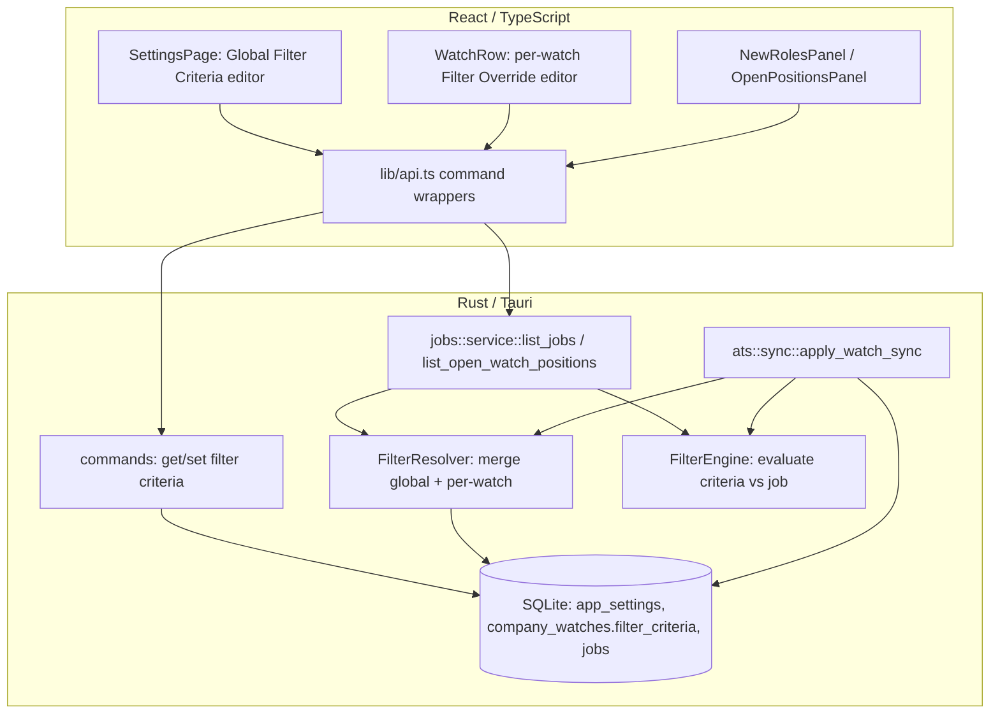
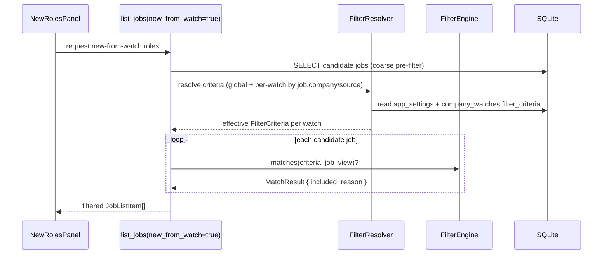

# Design Document: Watchlist Job Filtering

## Overview

Job Tracker watches company ATS boards (Greenhouse, Lever, Ashby) and surfaces newly discovered roles. Today, every remote role is ingested unconditionally, and filtering happens only at query time through two large hardcoded keyword-expansion functions (`expand_country_keywords`, `expand_location_keywords`) plus a single global comma-separated title-keyword list. This is imprecise (broad `LIKE '%substring%'` matching, ambiguity like `ca` = California vs Canada, region maps that only ship in code) and static (no runtime configurability beyond a global country/city string).

This design replaces the hardcoded, global, query-time approach with a **structured, runtime-configurable filter engine** that evaluates a normalized `FilterCriteria` value against a job's title and location in Rust. Criteria are resolved from a two-level hierarchy — a **global default** and optional **per-watch overrides** — so users can filter accurately (word-boundary tokens, explicit include/exclude, remote handling) and dynamically (edit criteria at runtime, per board, without code changes). Backward compatibility is preserved: existing `location_country`, `location_cities`, and `watch_role_keywords` settings are migrated into the new structured global criteria on first launch.

This document contains both a **High-Level Design** (architecture, data flow, components, data models) and a **Low-Level Design** (Rust structs, function signatures, the matching algorithm, migration plan, Tauri command surface, and frontend TypeScript wiring).

---

## Architecture



### Key Design Decisions

1. **One matching engine, two call sites.** A single pure `FilterEngine::matches(criteria, job_view)` function is the sole authority on "does this role match?". Both query-time listing (`list_jobs`, `list_open_watch_positions`) and — optionally — ingest-time discovery (`apply_watch_sync`) call it. This removes the current duplication of location SQL between `list_jobs` and `list_open_watch_positions`.

2. **Query-time filtering stays primary; ingest-time tagging is additive.** Changing filter criteria must not require re-syncing every board, and a user who tightens criteria should not permanently lose already-discovered roles. So evaluation happens at **query time** against stored jobs. Ingest still stores every remote role (preserving today's behavior and the missing-from-sync lifecycle), but records whether it *would* match current criteria via a `watch_filtered` flag used only as a fast pre-filter — never as a destructive gate. This keeps criteria fully dynamic: editing them re-filters instantly on the next list call.

3. **In-memory evaluation over SQL keyword expansion.** The current SQL builds dozens of `LIKE` clauses from hardcoded maps. Instead, the query fetches candidate watch rows with a coarse SQL pre-filter (state + provider), then evaluates the precise `FilterCriteria` in Rust. This enables word-boundary matching and include/exclude precedence that SQL `LIKE` cannot express cleanly, and moves the region knowledge into data (an editable alias table) rather than code.

4. **Two-level criteria hierarchy with explicit merge.** Global criteria apply to all watches; a per-watch override, when present, *replaces* the global criteria for that watch (not merged field-by-field), which is the most predictable mental model. A per-watch `null` means "use global".

5. **Backward compatibility via migration, not dual code paths.** Legacy `location_country` / `location_cities` / `watch_role_keywords` settings are converted once into a structured global `FilterCriteria` and stored under a new settings key. The old keys are retained (read-only) for one release so a rollback is safe.

### Data Flow: Listing New Roles (query time)



### Data Flow: Sync (ingest time)

```mermaid
sequenceDiagram
    participant SY as apply_watch_sync
    participant RES as FilterResolver
    participant ENG as FilterEngine
    participant DB as SQLite

    SY->>RES: resolve effective criteria for this watch
    RES-->>SY: FilterCriteria
    loop each remote AtsJob
        SY->>ENG: matches(criteria, job_view)?
        ENG-->>SY: MatchResult
        SY->>DB: upsert job, set watch_filtered = included
    end
    Note over SY,DB: All roles still stored; watch_filtered is a hint, not a gate
```

---

## Components and Interfaces

### Component 1: Filter Criteria Model (`filtering::model`)

**Purpose**: The serializable, versioned representation of what to include/exclude. Stored as JSON in `app_settings` (global) and `company_watches.filter_criteria` (per-watch).

**Responsibilities**:
- Define `FilterCriteria`, `LocationCriteria`, `TitleCriteria`, `RemoteMode`.
- Serialize/deserialize to JSON with a `version` field for forward migration.
- Provide `FilterCriteria::match_all()` (empty = include everything).

### Component 2: Location Alias Resolver (`filtering::aliases`)

**Purpose**: Replaces the hardcoded `expand_*_keywords` region maps with a data-driven alias table (region → member tokens; country → state/abbrev tokens) that can be seeded and later edited without recompiling.

**Responsibilities**:
- Expand a user region token ("bay area") into its member tokens.
- Resolve country → canonical name + state abbreviations, disambiguating collisions (e.g. `ca` only expands to California when country is US, to nothing when Canada).
- Ship a default seed identical in coverage to today's maps for parity.

### Component 3: Filter Engine (`filtering::engine`)

**Purpose**: Pure evaluation of one `FilterCriteria` against one job's title + location.

**Responsibilities**:
- Normalize text (lowercase, trim, collapse whitespace, tokenize on word boundaries).
- Apply precedence: **exclude wins over include**; empty include set means "match all on that dimension".
- Return a `MatchResult` with a human-readable reason for debugging/telemetry.

### Component 4: Filter Resolver (`filtering::resolver`)

**Purpose**: Produce the effective `FilterCriteria` for a given watch/job by merging global defaults with per-watch overrides, and by applying the legacy migration shim.

**Responsibilities**:
- Read global criteria from `app_settings`.
- Read per-watch criteria from `company_watches.filter_criteria`.
- Return per-watch override if present, else global, else `match_all()`.
- Cache resolved criteria per company/source within a single list call.

### Component 5: Tauri Command Surface (`commands`)

**Purpose**: Expose get/set for global and per-watch criteria to the frontend.

**Interface** (see Low-Level Design for full signatures):
- `get_filter_criteria` / `set_filter_criteria` (global)
- `get_watch_filter_criteria` / `set_watch_filter_criteria` (per-watch, keyed by `watch_id`)
- `preview_filter_match` (dry-run a criteria against sample locations/titles for the editor UI)

### Component 6: Frontend Filter Editor (`components/companies` + `pages/SettingsPage`)

**Purpose**: UI to edit global and per-watch criteria, replacing the free-text country/cities/keywords fields with structured include/exclude token inputs and a remote toggle.

**Responsibilities**:
- Render global criteria editor in Settings.
- Render a per-watch "Filter" disclosure in `WatchRow`.
- Live-preview which sample roles pass, via `preview_filter_match`.

---

## Data Models

### Model: `FilterCriteria`

```rust
struct FilterCriteria {
  version: u32,             // schema version, starts at 1
  title: TitleCriteria,
  location: LocationCriteria,
  remote: RemoteMode,
}
```

**Validation Rules**:
- `version` MUST be a known value; unknown versions are rejected on read (fail closed to `match_all()` with a logged warning).
- All token lists are trimmed and empties dropped on write.
- Tokens are stored as-entered but compared case-insensitively.

### Model: `TitleCriteria`

```rust
struct TitleCriteria {
  include: Vec<String>,   // any-of; empty => match all titles
  exclude: Vec<String>,   // none-of; empty => exclude nothing
  match_mode: MatchMode,  // Word (default) | Substring
}
```

**Validation Rules**:
- `Word` mode matches on whitespace/punctuation-delimited token boundaries ("qa" does not match "quality").
- `Substring` mode preserves today's `LIKE '%term%'` behavior for users who want it.

### Model: `LocationCriteria`

```rust
struct LocationCriteria {
  country: Option<String>,  // canonical country name or None = any
  include: Vec<String>,     // regions/cities/states; expanded via aliases
  exclude: Vec<String>,     // explicit location exclusions
  match_mode: MatchMode,
}
```

### Model: `RemoteMode`

```rust
enum RemoteMode {
  Any,          // no remote constraint (default)
  RemoteOnly,   // location text indicates remote
  OnsiteOnly,   // location text does NOT indicate remote
}
```

**Validation Rules**:
- Remote detection uses a normalized token set (`remote`, `anywhere`, `distributed`, `wfh`) plus alias table entries.

### Storage Layout

- **Global**: `app_settings` row `key = 'filter_criteria_v1'`, `value = <FilterCriteria JSON>`.
- **Per-watch**: new nullable column `company_watches.filter_criteria TEXT` holding `FilterCriteria JSON`, or `NULL` to inherit global.
- **Legacy (retained read-only for one release)**: `location_country`, `location_cities`, `watch_role_keywords`.
- **Aliases**: `app_settings` row `key = 'location_aliases_v1'`, `value = <AliasTable JSON>`, seeded on migration.

---

## Low-Level Design

### Module Layout

```
src-tauri/src/filtering/
  mod.rs        // re-exports
  model.rs      // FilterCriteria, TitleCriteria, LocationCriteria, RemoteMode, MatchMode
  aliases.rs    // AliasTable, default seed, expansion
  engine.rs     // normalize, tokenize, matches()
  resolver.rs   // resolve_effective_criteria(), legacy migration shim
```

### Core Types and Signatures

```rust
// filtering/model.rs
#[derive(Debug, Clone, Serialize, Deserialize, PartialEq)]
#[serde(rename_all = "camelCase")]
pub struct FilterCriteria {
    #[serde(default = "default_version")]
    pub version: u32,
    #[serde(default)]
    pub title: TitleCriteria,
    #[serde(default)]
    pub location: LocationCriteria,
    #[serde(default)]
    pub remote: RemoteMode,
}

#[derive(Debug, Clone, Serialize, Deserialize, PartialEq, Default)]
#[serde(rename_all = "camelCase")]
pub struct TitleCriteria {
    #[serde(default)]
    pub include: Vec<String>,
    #[serde(default)]
    pub exclude: Vec<String>,
    #[serde(default)]
    pub match_mode: MatchMode,
}

#[derive(Debug, Clone, Serialize, Deserialize, PartialEq, Default)]
#[serde(rename_all = "camelCase")]
pub struct LocationCriteria {
    #[serde(default)]
    pub country: Option<String>,
    #[serde(default)]
    pub include: Vec<String>,
    #[serde(default)]
    pub exclude: Vec<String>,
    #[serde(default)]
    pub match_mode: MatchMode,
}

#[derive(Debug, Clone, Copy, Serialize, Deserialize, PartialEq, Default)]
#[serde(rename_all = "camelCase")]
pub enum MatchMode {
    #[default]
    Word,
    Substring,
}

#[derive(Debug, Clone, Copy, Serialize, Deserialize, PartialEq, Default)]
#[serde(rename_all = "camelCase")]
pub enum RemoteMode {
    #[default]
    Any,
    RemoteOnly,
    OnsiteOnly,
}

impl FilterCriteria {
    /// The identity criteria: includes every job.
    pub fn match_all() -> Self { /* all lists empty, RemoteMode::Any */ }

    /// True when this criteria would include every possible job.
    pub fn is_match_all(&self) -> bool { /* all include/exclude empty && remote == Any */ }
}

fn default_version() -> u32 { 1 }
```

```rust
// filtering/engine.rs
/// A minimal read-only view of the fields the engine inspects.
pub struct JobView<'a> {
    pub title: &'a str,
    pub location: Option<&'a str>,
}

pub struct MatchResult {
    pub included: bool,
    pub reason: String, // e.g. "excluded by title token 'contract'"
}

/// Pure: no I/O, no DB, deterministic. The single source of truth for matching.
pub fn matches(
    criteria: &FilterCriteria,
    aliases: &AliasTable,
    job: JobView<'_>,
) -> MatchResult;

/// Lowercase, trim, collapse internal whitespace.
pub(crate) fn normalize(text: &str) -> String;

/// Split normalized text into word-boundary tokens (alphanumerics; split on
/// whitespace and punctuation such as , / ( ) - •).
pub(crate) fn tokenize(normalized: &str) -> Vec<String>;

/// True if `needle` matches `haystack` under the given mode.
/// Word mode: multi-word needles match as an ordered contiguous token run.
pub(crate) fn term_matches(haystack_tokens: &[String], haystack_norm: &str,
                           needle: &str, mode: MatchMode) -> bool;
```

```rust
// filtering/aliases.rs
#[derive(Debug, Clone, Serialize, Deserialize)]
#[serde(rename_all = "camelCase")]
pub struct AliasTable {
    pub version: u32,
    /// region token -> member location tokens (e.g. "bay area" -> ["san francisco", ...])
    pub regions: HashMap<String, Vec<String>>,
    /// country canonical name -> expansion tokens (states, abbrevs, hubs)
    pub countries: HashMap<String, Vec<String>>,
    /// tokens that indicate remote work
    pub remote_tokens: Vec<String>,
}

impl AliasTable {
    /// Seed with parity to today's expand_country_keywords / expand_location_keywords.
    pub fn default_seed() -> Self;

    /// Expand a user-entered location token to itself plus any alias members.
    /// Country context disambiguates collisions (e.g. "ca").
    pub fn expand_location(&self, token: &str, country: Option<&str>) -> Vec<String>;

    pub fn is_remote(&self, location_norm: &str) -> bool;
}
```

```rust
// filtering/resolver.rs
/// Return the effective criteria for a watch: per-watch override if present,
/// else global, else match_all(). Reads app_settings + company_watches.
pub fn resolve_effective_criteria(
    conn: &Connection,
    company_id: &str,
    source: &str,
) -> AppResult<FilterCriteria>;

pub fn get_global_criteria(conn: &Connection) -> AppResult<FilterCriteria>;
pub fn set_global_criteria(conn: &Connection, c: &FilterCriteria) -> AppResult<()>;

pub fn get_watch_criteria(conn: &Connection, watch_id: &str)
    -> AppResult<Option<FilterCriteria>>;
pub fn set_watch_criteria(conn: &Connection, watch_id: &str,
    c: Option<&FilterCriteria>) -> AppResult<()>;

pub fn load_alias_table(conn: &Connection) -> AppResult<AliasTable>;

/// One-time: build a FilterCriteria from legacy settings if the new key is absent.
pub fn migrate_legacy_settings(conn: &Connection) -> AppResult<()>;
```

### Matching Algorithm

```pascal
ALGORITHM matches(criteria, aliases, job)
INPUT: criteria (FilterCriteria), aliases (AliasTable), job (JobView)
OUTPUT: MatchResult { included, reason }

BEGIN
  // --- Empty criteria includes everything ---
  IF criteria.is_match_all() THEN
    RETURN { included: true, reason: "no criteria" }
  END IF

  title_norm    ← normalize(job.title)
  title_tokens  ← tokenize(title_norm)
  loc_norm      ← normalize(job.location OR "")
  loc_tokens    ← tokenize(loc_norm)

  // --- TITLE ---
  // Exclude wins first.
  FOR each term IN criteria.title.exclude DO
    IF term_matches(title_tokens, title_norm, term, criteria.title.match_mode) THEN
      RETURN { included: false, reason: "excluded by title '" + term + "'" }
    END IF
  END FOR
  IF criteria.title.include NOT EMPTY THEN
    matched ← false
    FOR each term IN criteria.title.include DO
      IF term_matches(title_tokens, title_norm, term, criteria.title.match_mode) THEN
        matched ← true; BREAK
      END IF
    END FOR
    IF NOT matched THEN
      RETURN { included: false, reason: "no title include matched" }
    END IF
  END IF

  // --- REMOTE ---
  is_remote ← aliases.is_remote(loc_norm)
  IF criteria.remote = RemoteOnly AND NOT is_remote THEN
    RETURN { included: false, reason: "not remote" }
  END IF
  IF criteria.remote = OnsiteOnly AND is_remote THEN
    RETURN { included: false, reason: "remote excluded" }
  END IF

  // --- LOCATION ---
  // Build the effective location include set by expanding aliases + country.
  expanded_include ← []
  FOR each tok IN criteria.location.include DO
    expanded_include ← expanded_include ∪
        aliases.expand_location(tok, criteria.location.country)
  END FOR
  IF criteria.location.country IS PRESENT THEN
    expanded_include ← expanded_include ∪
        aliases.countries[canonical(criteria.location.country)]
  END IF

  // Exclude wins.
  FOR each term IN criteria.location.exclude DO
    IF term_matches(loc_tokens, loc_norm, term, criteria.location.match_mode) THEN
      RETURN { included: false, reason: "excluded by location '" + term + "'" }
    END IF
  END FOR

  IF expanded_include NOT EMPTY THEN
    // Remote roles bypass location include only when remote is allowed AND
    // no specific location is present, to avoid dropping "Remote - US" style rows.
    IF criteria.remote != OnsiteOnly AND is_remote AND loc_has_no_place(loc_tokens) THEN
      RETURN { included: true, reason: "remote passes location gate" }
    END IF
    matched ← false
    FOR each term IN expanded_include DO
      IF term_matches(loc_tokens, loc_norm, term, criteria.location.match_mode) THEN
        matched ← true; BREAK
      END IF
    END FOR
    IF NOT matched THEN
      RETURN { included: false, reason: "no location include matched" }
    END IF
  END IF

  RETURN { included: true, reason: "all criteria satisfied" }
END
```

**Preconditions**: `criteria` deserialized with a known version; `aliases` loaded (defaults if absent).
**Postconditions**: `included` reflects exclude-over-include precedence; deterministic; no mutation of inputs.
**Loop invariants**: exclusion loops short-circuit on first hit; include loops set `matched` true and break on first hit, leaving prior non-matches irrelevant.

### Integration into `list_jobs` / `list_open_watch_positions`

The current inline `expand_country_keywords` / `expand_location_keywords` SQL blocks in `list_jobs` and the duplicated block in `list_open_watch_positions` are removed. Replacement flow:

```pascal
ALGORITHM list_watch_jobs(conn, filters)
BEGIN
  // 1. Coarse SQL: fetch candidate watch-sourced rows (indexes preserved).
  rows ← SELECT ... WHERE is_new_from_watch = 1  // (or open-positions predicate)

  // 2. Group by (company_id, source); resolve criteria once per group (cached).
  aliases ← load_alias_table(conn)
  FOR each row IN rows DO
    criteria ← resolver.resolve_effective_criteria(conn, row.company_id, row.source)  // cached
    result   ← engine.matches(criteria, aliases, JobView { row.title, row.location })
    IF result.included THEN keep row
  END FOR
  RETURN kept rows (ordered by updated_at DESC, LIMIT applied post-filter)
END
```

Because the fine filter is applied in Rust after fetch, `LIMIT` must be applied *after* filtering. The coarse query keeps a sane upper bound (e.g. fetch cap) to avoid loading unbounded rows; the preview cap already used for watch previews continues to apply.

### Migration Plan (`db/migrate.rs`)

Following the existing additive pattern (PRAGMA table_info check, then `ALTER TABLE`):

```pascal
1. Add column if missing:
     ALTER TABLE company_watches ADD COLUMN filter_criteria TEXT   // nullable, default NULL

2. Seed alias table if absent:
     IF app_settings has no 'location_aliases_v1' THEN
       INSERT AliasTable::default_seed() as JSON

3. Legacy → structured global criteria (run once):
     IF app_settings has no 'filter_criteria_v1' THEN
       country  ← app_settings['location_country']    (may be empty)
       cities   ← app_settings['location_cities']      (may be empty)
       keywords ← app_settings['watch_role_keywords']  (may be empty)
       criteria ← FilterCriteria {
         title.include    = split(keywords on ',' | '\n'),  match_mode = Word,
         location.country = country if non-empty else None,
         location.include = split(cities on ','),
         remote           = Any,
       }
       INSERT criteria as 'filter_criteria_v1'
     // Legacy keys are NOT deleted this release (safe rollback).
```

**Constraints**:
- Migration is idempotent (guarded by "key absent" checks), matching existing migrate.rs style.
- No data loss: legacy keys retained; jobs table untouched except the additive `watch_filtered` hint below.
- Optional additive hint column (used only as sync-time annotation, never a query gate):
  `ALTER TABLE jobs ADD COLUMN watch_filtered INTEGER` (nullable; NULL = not yet evaluated).

### Tauri Command Surface (`commands/mod.rs` + `lib.rs`)

```rust
#[tauri::command]
pub async fn get_filter_criteria(state: State<'_, AppState>)
    -> AppResult<FilterCriteria>;

#[tauri::command]
pub async fn set_filter_criteria(criteria: FilterCriteria, state: State<'_, AppState>)
    -> AppResult<()>;

#[tauri::command]
pub async fn get_watch_filter_criteria(watch_id: String, state: State<'_, AppState>)
    -> AppResult<Option<FilterCriteria>>;

#[tauri::command]
pub async fn set_watch_filter_criteria(
    watch_id: String,
    criteria: Option<FilterCriteria>, // None clears the override (inherit global)
    state: State<'_, AppState>,
) -> AppResult<()>;

/// Dry-run for the editor: return which sample entries pass.
#[tauri::command]
pub async fn preview_filter_match(
    criteria: FilterCriteria,
    samples: Vec<PreviewSample>,   // { title, location }
    state: State<'_, AppState>,
) -> AppResult<Vec<PreviewOutcome>>; // { included, reason }
```

All registered in the `tauri::generate_handler!` list in `lib.rs` alongside the existing commands. The legacy `get/set_watch_role_keywords` and `get/set_location_settings_cmd` remain registered but are marked deprecated; their setters also write through to `filter_criteria_v1` so the two surfaces stay consistent during the transition.

### Frontend Types and Wiring

```typescript
// desktop/src/lib/api.ts
export type MatchMode = "word" | "substring";
export type RemoteMode = "any" | "remoteOnly" | "onsiteOnly";

export type FilterCriteria = {
  version: number;
  title: { include: string[]; exclude: string[]; matchMode: MatchMode };
  location: {
    country: string | null;
    include: string[];
    exclude: string[];
    matchMode: MatchMode;
  };
  remote: RemoteMode;
};

// api object additions
getFilterCriteria: () => call<FilterCriteria>("get_filter_criteria"),
setFilterCriteria: (criteria: FilterCriteria) =>
  call<void>("set_filter_criteria", { criteria }),
getWatchFilterCriteria: (watchId: string) =>
  call<FilterCriteria | null>("get_watch_filter_criteria", { watchId }),
setWatchFilterCriteria: (watchId: string, criteria: FilterCriteria | null) =>
  call<void>("set_watch_filter_criteria", { watchId, criteria }),
previewFilterMatch: (criteria: FilterCriteria, samples: {title:string;location:string}[]) =>
  call<{ included: boolean; reason: string }[]>("preview_filter_match", { criteria, samples }),
```

**UI wiring**:
- `SettingsPage.tsx`: replace the two free-text "Role Keywords" and "Location Preferences" sections with a single **Global Filter** editor: token chips for title include/exclude, a country select (existing options), region/city include/exclude chips, a remote radio (Any / Remote only / Onsite only), and a live preview list.
- `WatchRow.tsx`: add a collapsible "Filter for this board" disclosure. Empty state shows "Using global filter"; when the user customizes it, calls `setWatchFilterCriteria(watch.id, criteria)`; a "Reset to global" action calls `setWatchFilterCriteria(watch.id, null)`.
- A shared `FilterCriteriaEditor` component renders the chip inputs + preview and is reused in both places.
- `CompanyWatch` schema type in `lib/schema.ts` gains an optional `filterCriteria: FilterCriteria | null`.

### Example Usage (Rust)

```rust
// Query-time, inside list_jobs after the coarse SELECT:
let aliases = filtering::resolver::load_alias_table(conn)?;
let mut cache: HashMap<(String, String), FilterCriteria> = HashMap::new();

candidates.retain(|item| {
    let key = (item.job.company_id.clone(), item.job.source.clone());
    let criteria = cache.entry(key).or_insert_with(|| {
        filtering::resolver::resolve_effective_criteria(
            conn, &item.job.company_id, &item.job.source,
        ).unwrap_or_else(|_| FilterCriteria::match_all())
    });
    filtering::engine::matches(
        criteria,
        &aliases,
        filtering::engine::JobView {
            title: &item.job.title,
            location: item.job.location.as_deref(),
        },
    ).included
});
```

---

## Correctness Properties

These are the invariants the matching engine and resolver must satisfy. Each is stated as a universal property suitable for property-based tests (e.g. `proptest`).

### Property 1: Empty criteria matches all

For all jobs `j`: `matches(FilterCriteria::match_all(), aliases, j).included == true`. Equivalently, criteria whose title/location include+exclude are all empty and `remote == Any` include every job.

### Property 2: Exclude precedence

For all jobs `j` and criteria `c`: if any active exclude term matches `j`'s corresponding field, then `matches(c, aliases, j).included == false`, regardless of include terms. Exclude always overrides include.

### Property 3: Include is any-of (disjunctive)

For all jobs `j`: if `title.include` is non-empty, `j` passes the title gate iff at least one include term matches. A job matching zero include terms (and no exclude) is excluded when includes are present.

### Property 4: Case-insensitivity

For all jobs `j` and any case variant `j'` of `j`'s title/location: `matches(c, aliases, j).included == matches(c, aliases, j').included`. Likewise criteria tokens compare case-insensitively.

### Property 5: No substring false positives in Word mode

In `Word` mode, a single-token needle matches only whole tokens: `matches` for include `["qa"]` returns `included == false` for title "Quality Assurance Engineer" (no standalone "qa" token), and `true` for "QA Engineer". (This directly addresses the `ca`/California-vs-Canada class of ambiguity.)

### Property 6: Country disambiguation

For the token `ca`: with `location.country == "Canada"`, `expand_location("ca", Some("canada"))` does NOT include California hubs; with `country == "United States"`, `ca` may expand to California tokens. No cross-country leakage.

### Property 7: Determinism & purity

`matches` is a pure function: for fixed `(criteria, aliases, job)` it always returns the same result and mutates none of its inputs.

### Property 8: Idempotent migration

Running `migrate_legacy_settings` more than once yields the same `filter_criteria_v1` value and never overwrites a user-modified structured criteria (guarded by "key absent").

### Property 9: Override replaces, not merges

For a watch with a per-watch override `o`, `resolve_effective_criteria` returns exactly `o` (never a field-level blend with global); a `null` override returns exactly the global criteria.

### Property 10: Query/ingest agreement

For the same `(criteria, aliases, job)`, the query-time and sync-time call sites produce identical `included` values (single shared engine guarantees this).

### Property 11: Remote gate soundness

`RemoteOnly` includes a job only if `aliases.is_remote(location)`; `OnsiteOnly` excludes any job where `is_remote` is true. `Any` imposes no remote constraint.

### Property 12: Whitespace/punctuation invariance

Locations differing only in surrounding whitespace or delimiter spacing ("San Jose, CA" vs "San Jose,CA" vs " San Jose , CA ") produce identical match results.

---

## Error Handling

### Scenario 1: Malformed / unknown-version criteria JSON in storage

**Condition**: `app_settings.filter_criteria_v1` or `company_watches.filter_criteria` fails to deserialize, or carries an unknown `version`.
**Response**: Log a warning; fall back to `FilterCriteria::match_all()` for that scope (fail open — show more rather than silently hide everything).
**Recovery**: Next successful `set_*` overwrites the bad value with valid JSON.

### Scenario 2: Alias table missing or corrupt

**Condition**: `location_aliases_v1` absent or invalid.
**Response**: Use `AliasTable::default_seed()` in memory.
**Recovery**: Migration re-seeds on next launch if absent.

### Scenario 3: Invalid criteria submitted from UI

**Condition**: `set_filter_criteria` / `set_watch_filter_criteria` receives unknown `version` or non-array token fields.
**Response**: Return `AppError` with a clear message; do not persist.
**Recovery**: UI surfaces the error; prior stored value is unchanged.

### Scenario 4: Unknown `watch_id` for per-watch set/get

**Condition**: `watch_id` does not exist.
**Response**: Return `AppError::from("Watch not found")`, mirroring existing watch command behavior.

---

## Testing Strategy

### Unit Testing
- `engine::normalize` / `tokenize`: whitespace collapse, punctuation splitting, unicode-safe lowercasing.
- `engine::term_matches`: Word vs Substring, multi-word contiguous matching.
- `aliases::expand_location`: region expansion, country disambiguation (`ca`), remote token detection.
- `resolver`: override-vs-global selection, `null` inheritance, legacy migration output, idempotency.
- Parity test: seeded alias table + a corpus of real ATS locations produces a superset/equivalent match set to the current `expand_*` functions for representative inputs (guards against regression during cutover).

### Property-Based Testing
- **Library**: `proptest` (Rust).
- Encode Correctness Properties 1–12 as properties over randomly generated `FilterCriteria` and job title/location strings. Key generators: token lists (including overlapping include/exclude), case-randomized strings, whitespace/punctuation-perturbed locations.

### Integration Testing
- `list_jobs(new_from_watch=true)` and `list_open_watch_positions` against an in-memory DB seeded with jobs + watches + global/per-watch criteria; assert the returned set matches expectations and that `LIMIT` is applied post-filter.
- Migration test: build a legacy `app_settings` (country/cities/keywords) and assert `filter_criteria_v1` is derived correctly and legacy keys are retained.
- Command round-trip: `set_filter_criteria` → `get_filter_criteria` and per-watch equivalents.

## Performance Considerations

- Query-time evaluation is O(candidates × terms); candidate count is bounded by the coarse SQL predicate and existing preview caps. Criteria are resolved once per `(company_id, source)` and cached within a call, and the alias table is loaded once per call.
- Tokenization allocates per job; for large boards this is acceptable but the normalized location/title can be computed once per row. If profiling shows cost, cache `watch_filtered` from the last sync as a fast-path pre-filter (already provisioned as an additive column).

## Security Considerations

- Criteria are user-supplied strings compared in memory; no SQL injection surface since the fine filter no longer interpolates user tokens into SQL. The coarse SQL uses only fixed predicates and bound parameters.
- JSON stored in `app_settings` / `company_watches` is validated on read; unknown versions fail open to `match_all()` rather than executing unexpected logic.

## Dependencies

- Existing: `rusqlite`, `serde`, `serde_json`, `chrono` (already in use).
- New (test-only): `proptest` for property-based tests.
- No new runtime frontend dependencies; the editor reuses existing UI primitives and `lib/api.ts` call wrapper.
