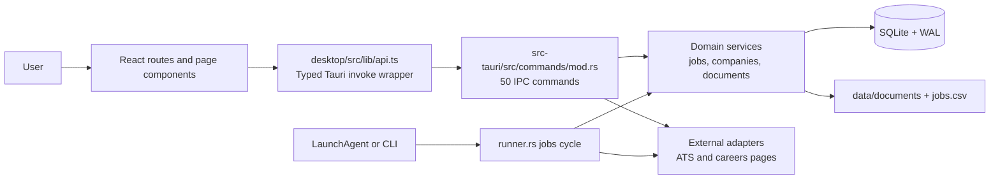
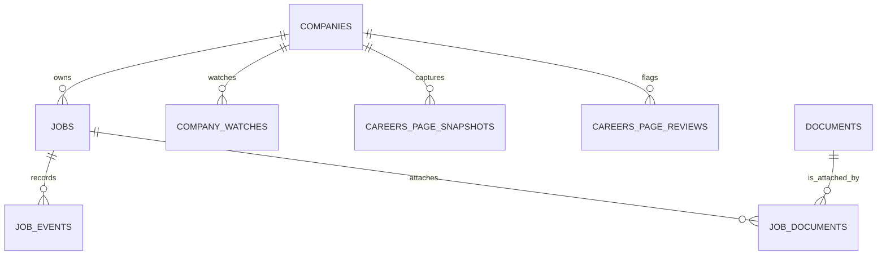
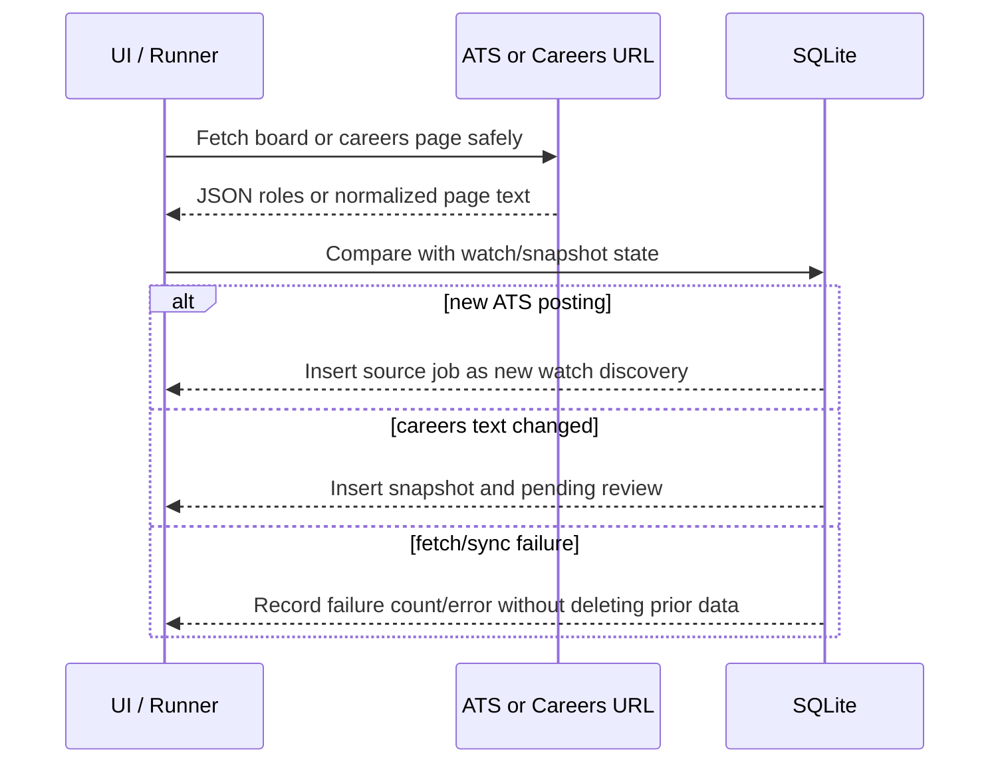
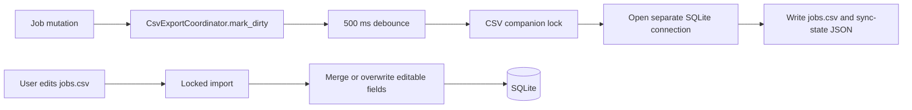

# Job Tracker code walkthrough

This is a line-oriented guide to the current app. It follows the execution path first, then the feature paths. A reference such as `src-tauri/src/lib.rs:21-66` means those lines work together as one unit; long, repetitive JSX and SQL field lists are described by the block that owns them instead of being repeated line for line.

## The application in one picture



The browser UI never connects to a web server. In a Tauri window, `invoke` calls Rust in the same desktop app. SQLite and the CSV/document files stay in the selected local data directory.

## Read this code in this order

1. Native startup: `src-tauri/src/main.rs`, `src-tauri/src/lib.rs`
2. Browser startup and routes: `desktop/src/main.tsx`, `desktop/src/App.tsx`
3. IPC contract: `desktop/src/lib/api.ts` and `src-tauri/src/commands/mod.rs`
4. Storage and job rules: `db/`, `models.rs`, `jobs/service.rs`
5. Feature adapters and the background worker: `ats/`, `runner.rs`

## 1. Startup, line by line

### Native executable: `src-tauri/src/main.rs`

| Lines | What happens |
| --- | --- |
| 1-2 | Hides the extra Windows console in release builds. It has no effect on the macOS app. |
| 4-5 | Imports Clap's parser and the app's CLI definition. |
| 7-8 | Starts `main` and collects raw arguments before parsing them. |
| 10-17 | Treats no argument, or macOS's `-psn_...` launch token, as a graphical launch. It calls `job_tracker_lib::run()` and returns. |
| 19-30 | Parses an explicit command. A CLI subcommand or `--run-jobs` creates a Tokio runtime, awaits `run_cli`, prints an error, and exits non-zero if it fails. |
| 32-34 | Keeps a parsed invocation with no command as a GUI launch. |
| 35-39 | Lets Clap print its own help/error text and chooses its recommended exit code. |

### Tauri bootstrap: `src-tauri/src/lib.rs`

| Lines | What happens |
| --- | --- |
| 1-12 | Declares the internal modules. `cli` is public because `main.rs` imports its argument types. |
| 21-25 | Builds Tauri and enables shell, file-system, and native dialog plugins. |
| 26-33 | During setup, adds the debug log plugin only in debug builds. |
| 35-54 | Resolves the data directory, optionally migrates legacy release data, opens SQLite, runs migrations, and stores `AppState` in Tauri's managed state. |
| 56-64 | Adds an 800 ms safety fallback that shows the hidden main window if the frontend does not call `show_main_window`. |
| 68-119 | Registers every callable Rust command. A frontend command string must appear here or Tauri will reject it. |
| 120-121 | Loads the generated Tauri configuration and starts the native event loop. |
| 124-125 | Re-exports the CLI and runner entry points for `main.rs`. |

### UI bootstrap: `desktop/index.html`, `desktop/src/main.tsx`, `desktop/src/App.tsx`

| File and lines | What happens |
| --- | --- |
| `desktop/index.html:8-26` | Sets neutral light/dark background colors before React mounts, preventing a flash of the wrong theme. |
| `desktop/index.html:27-40` | Reads `localStorage.theme`; otherwise uses the operating-system preference; adds the `dark` class before paint. |
| `desktop/index.html:44-45` | Supplies React's `#root` mount element and loads the TypeScript entry module. |
| `desktop/src/main.tsx:1-10` | Imports the app and CSS, then mounts `<App />` inside React `StrictMode`. |
| `desktop/src/App.tsx:17-41` | Defines the normal-browser fallback. A browser can render the shell but cannot use Tauri's Rust bridge, so it shows the command required to open the app. |
| `desktop/src/App.tsx:43-52` | On first mount, asks Rust to show/focus the main window. Outside Tauri it returns the fallback instead of mounting usable-looking broken controls. |
| `desktop/src/App.tsx:54-69` | Provides theme state, creates the browser router, wraps pages in `Layout`, and declares routes for jobs, documents, companies, and settings. |

## 2. Data location, state, and database

### Data directory: `src-tauri/src/db/paths.rs`

`DataPaths` at lines 8-16 is the canonical list of local paths: database, document store, CSV mirror, worker log, and two lock files. `from_data_dir` (19-35) derives all of them from one root; `ensure_dirs` (37-43) creates the directory and document folder.

`resolve_data_dir` (50-63) applies this order:

```text
JOB_TRACKER_DATA_DIR
        ↓ otherwise
debug build: repository data/ when discoverable
        ↓ otherwise
Tauri Application Support directory / ~/Library/Application Support/com.jobtracker.local
```

`find_repo_data_dir` (65-84) handles launches from the repository root, `src-tauri/`, or a nearby directory. `dirs_fallback` (86-91) is the final macOS-only fallback.

### Shared application state: `src-tauri/src/db/mod.rs:17-65`

`AppState` has four pieces:

| Field | Purpose |
| --- | --- |
| `paths` | The resolved local filesystem locations. |
| `db` | One `rusqlite::Connection` behind a parking-lot mutex for short synchronous DB work. |
| `runner_lock` | An async in-process lock preventing two expensive jobs cycles in the same app process. |
| `csv_export` | A debounced coordinator that writes the CSV after mutations. |

`AppState::open` (28-45) ensures directories, opens SQLite, enables WAL, sets a 5-second busy timeout and foreign keys, runs migrations, and constructs the CSV coordinator. `with_db` (47-50) locks only while a closure performs a database operation. `with_db_tx` (52-65) explicitly begins an immediate SQLite transaction, commits a successful closure, and rolls back an error.

### Schema: `src-tauri/src/db/migrate.rs`

The first `execute_batch` (6-140) creates tables and indexes safely for a fresh database. Lines 142-192 are the compatibility migration for existing databases: inspect `PRAGMA table_info(jobs)`, add newer columns only when absent, create the matching indexes, then backfill watch triage state.



Important constraints are encoded in the migration rather than in the UI:

- `jobs.canonical_url` is unique (line 41), preventing duplicate tracked postings.
- `(source, source_external_id)` is unique when the external ID exists (42-43), preventing a watch sync from creating the same ATS posting repeatedly.
- document checksums are unique (75), so identical imports reuse a record.
- company watches and job-document relations each have unique composite indexes (125-128).

### Shared data shapes: `src-tauri/src/models.rs`

Lines 3-160 define Rust structs serialized to camelCase JSON. The TypeScript mirror is `desktop/src/lib/schema.ts:1-170`. Keep these in sync when adding a field: Rust database mapper → Rust model → Tauri response → TypeScript type → rendering component.

| Lines | Shape | Why it exists |
| --- | --- | --- |
| 5-11 | `Company` | Company identity plus optional careers page. |
| 15-37 | `Job` | Main posting record, including state, source, triage, favorite, notes, and description. |
| 41-48 | `JobEvent` | Auditable timeline entries such as creation, state change, or document attachment. |
| 52-70 | `Document`, `JobDocument` | Content-addressed library record and its job-specific attachment. |
| 74-96 | Watch and careers review shapes | Monitoring state and changes requiring a user decision. |
| 100-144 | View models | List rows, job detail, and seven-day activity data that avoid repeated frontend joins. |
| 146-159 | Allowed job statuses | One source of truth used by service validation. |

## 3. The frontend contract and page flow

### Typed IPC client: `desktop/src/lib/api.ts`

`call` at lines 116-121 is the only shared transport primitive. It first checks `isDesktopShell`, then delegates to Tauri's `invoke`. The `api` object at lines 123-251 gives UI code typed names for all 50 registered Rust commands. Payload keys use camelCase; Rust's `#[serde(rename_all = "camelCase")]` converts them to the fields expected by each command argument struct.

| API range | Calls | Rust command family |
| --- | --- | --- |
| 124-163 | Lists, dashboard, create/preview/get/update/delete/archive/favorite/check | Jobs |
| 165-201 | Companies, watches, careers reviews, watch triage | Company monitoring |
| 203-211 | Document list/import/attach/open | Documents |
| 213-220 | CSV configuration | CSV mirror |
| 222-236 | Jobs cycle, settings, and window visibility | Background runner/app settings |

### Layout and routes

`desktop/src/components/Layout.tsx:15-21` defines navigation once. Lines 23-79 render that navigation, the theme button, background-run button, nested route outlet, and the local-storage footer.

| Route | Page component | What it loads |
| --- | --- | --- |
| `/` | `JobsPage` | Filtered jobs, dashboard counts/activity, companies, and a small watch-discovery preview. |
| `/jobs/new` | `NewJobPage` | URL preview, optional board/careers confirmation, then creation. |
| `/jobs/:id` | `JobDetailPage` + `JobDetailClient` | Detail, timeline, attachments, saving, posting check, archive, and delete. |
| `/documents` | `DocumentsPage` + `DocumentsClient` | Document library and import. |
| `/companies` | `CompaniesPage` + `CompaniesClient` | Companies, their watches, careers reviews, and discovery counts. |
| `/companies/:id` | `CompanyDetailPage` | One company and its watch-management controls. |
| `/settings` | `SettingsPage` | CSV path plus watch-keyword and location settings. |

### Jobs dashboard: `desktop/src/pages/JobsPage.tsx`

| Lines | What happens |
| --- | --- |
| 37-44 | Reads filters and display mode from the URL, making views linkable and reload-safe. Favorites default to the board view. |
| 46-62 | Holds loaded records, UI loading/errors, background progress, and in-flight action IDs. `loadSequenceRef` prevents older async responses from overwriting newer filters. |
| 64-122 | `load` concurrently fetches the filtered list, dashboard aggregates, company list, and watch preview. It captures a sequence number and request key, accepting results only if they still match. |
| 124-146 | Runs the initial/re-filter load and subscribes to native `jobs-runner-progress` events only inside Tauri. Cleanup removes the listener. |
| 148-172 | Clears completed progress after three seconds and runs the all-postings check, then quietly refreshes records. |
| 174-189 | Approves or dismisses a discovered ATS role and refreshes after the mutation. |
| 191-230 | Optimistically changes favorite/status UI. The server response confirms favorite state; errors reload authoritative data. |
| 233-270 | Archives/restores/deletes, and installs an Escape handler for the delete dialog. |
| 272-314 | Writes list/board and form filters back into `URLSearchParams`. |
| 316-795 | Renders pipeline navigation, filters, progress/errors, list or board results, watch preview, dashboard stats, and deletion confirmation. |
| 796-903 | Small pure presentation components for activity bars, metric cards, and sidebar links. |

`desktop/src/components/JobsBoardView.tsx:15-304` takes the loaded list and callback functions; it does not own data fetching. It groups all statuses (41-56), renders four active pipeline columns (66-239), caps each at 25 records until expanded, and displays closed/archived roles separately (241-302).

### New job and detail editing

`NewJobPage` uses `useJobUrlPreview` to debounce/resolve a pasted URL. `desktop/src/lib/job-url-preview.ts:58-110` merges preview fields into the form and serializes only a confirmation that still matches the preview. This means the backend can validate a user-approved ATS board or careers page instead of blindly creating a watch.

`JobDetailClient` keeps `saved` and `draft` versions of form fields. Its save path sends one update, builds a new baseline from the returned detail, and preserves keystrokes made while that request was in flight. It also handles Cmd/Ctrl+S, the before-unload warning, direct favorite updates, individual posting checks, archive/restore, and the destructive-delete dialog.

## 4. Command layer: React reaches Rust here

`src-tauri/src/commands/mod.rs` is deliberately thin. It deserializes input, chooses transaction/locking boundaries, calls a domain module, marks CSV dirty when a user-editable job changes, and serializes the response.

| Lines | Command group | Rule enforced at the bridge |
| --- | --- | --- |
| 39-87 | `list_jobs_cmd` | Converts optional UI filters to `JobFilters` and returns `{ jobs }`. |
| 89-103 | `get_jobs_dashboard` | Keeps counts/activity separate from filter-sensitive job loading. |
| 105-213 | preview/create job | Validates confirmed board details together, validates the board remotely, validates careers URL shape, resolves a title before acquiring the DB transaction, creates company/job/watch atomically, then queues CSV export. |
| 492-576 | job detail and mutations | Performs CRUD, archive/favorite operations transactionally and marks CSV dirty afterward. |
| 578-589 | one posting check | Reads URL/state, awaits network fetch outside the mutex, then persists the outcome. |
| 591-752 | companies/watches/reviews | Validates a board before saving a watch. Sync uses both the in-process mutex and runner file lock. |
| 755-869 | documents | Base64-decodes bytes, stages/imports them in a DB transaction, then finalizes the file after commit; opens documents through Tauri's native shell plugin. |
| 871-1047 | CSV | Uses a CSV-specific lock and dedicated connection for file I/O; configuration restores the previous setting if import/export fails. |
| 1049-1117 | runner/settings/window | Starts guarded jobs operations, reads/writes app settings, and shows/focuses the webview window. |

## 5. Job domain rules

### Job service: `src-tauri/src/jobs/service.rs`

This module owns SQL queries and business rules, leaving page components and Tauri commands free of SQL details.

| Lines | Function block | Behavior |
| --- | --- | --- |
| 53-100 | title resolution and creation | Uses a supplied title first; otherwise resolves metadata/fallback text. Creation canonicalizes the URL, finds/creates the company, inserts the job, and records events. |
| 171-237 | company lookup and cleanup | Reuses a normalized company name. An empty company is removed only when it has neither a watch nor careers history. |
| 250-543 | filters and location expansion | Defines every list filter and expands country/city settings into search terms. |
| 545-685 | `list_jobs` | Builds the filtered job/company query, including archive, favorite, source, state, search, location, and optional SQL `LIMIT`. |
| 687-754 | open watch roles | Lists active ATS-sourced roles for one company, intentionally including dismissed roles so a user can reconsider them. |
| 756-843 | `get_job_detail` | Loads the job, company, event timeline, and attached documents into one view model. |
| 845-1016 | `update_job` | Validates fields, moves a job between companies when necessary, updates only supplied data, and appends the appropriate events. |
| 1018-1084 | delete/archive/restore | Permanently deletes a job's dependent records or changes it to/from `archived` with timeline evidence. |
| 1087-1164 | watch triage | Converts new watch discoveries to wishlist records, records a dismissal without allowing sync to recreate it, and permits a dismissed source role to return to review. |
| 1166-1316 | events/counts/favorites | Adds timeline entries, calculates pipeline statistics, and updates favorite state. |
| 1318-1439 | activity/settings | Creates the seven-day activity chart and persists role keyword/location settings in `app_settings`. |

### Fetching untrusted job URLs safely: `src-tauri/src/jobs/safe_fetch.rs`

| Lines | Protection or behavior |
| --- | --- |
| 9-11 | Limits response bodies to 1.5 MB, request time to 10 seconds, and redirect hops to five. |
| 23-44 | Recognizes loopback, private, link-local, and private IPv6 addresses. |
| 46-68 | Rejects `localhost`, `.local`, private IP literals, DNS names resolving to private addresses, and unresolvable names. |
| 70-98 | Normalizes method/Accept header and creates a client with redirects disabled so each hop can be revalidated. |
| 100-252 | Parses HTTP(S) URLs, checks the destination before each request, follows valid redirects manually, checks declared and actual body sizes, and returns a structured result instead of throwing network details through the UI. |
| 255-269 | Classifies 404/410 and common closed-posting text as inactive. |

`check_active.rs` combines that safe result with persistence: fetch the posting state, compare it with the prior state, and write timestamps/results/events. `metadata.rs` uses the same guarded network path to extract a preview title/company/description. `board_discovery.rs` recognizes only valid Greenhouse, Lever, Ashby, and conventional `/careers` URL forms.

## 6. Monitoring: ATS Boards And Careers Pages

### ATS watches and careers pages



- `ats/mod.rs:18-56` chooses the provider endpoint and obtains provider JSON through `safe_fetch`.
- `ats/mod.rs:58-158` parses provider-specific JSON into one `AtsJob` shape.
- `ats/sync.rs:56-263` separates the remote fetch from `apply_watch_sync`, which updates failure state, inserts new external IDs once, and tracks roles missing from a sync.
- `ats/careers.rs:10-55` strips volatile HTML content, normalizes text, and hashes a versioned representation.
- `ats/careers.rs:57-176` compares the new hash with the last snapshot and creates a pending review only when content changed.

## 7. Documents and the CSV mirror

### Documents

`documents.rs:14-40` accepts only PDF, DOCX, and TXT content within a 10 MB limit. `import_document` (42-107) validates bytes, hashes them, writes a temporary content-addressed file, and inserts/reuses its database row. The command layer commits that row before calling `finalize_staged_document` (108-137), which moves the file into its final path; a failed finalization removes the row so the library never advertises a missing file. Lines 156-215 attach, detach, and resolve document paths; lines 218-301 list documents with usage context.

### CSV



`jobs/csv.rs` parses/serializes CSV, stores the last exported state, computes merge conflicts, and imports/export rows. `csv_config.rs` selects a default or custom local CSV file and derives its companion lock path. `csv_export.rs:1-5` states the important design: mutation returns quickly, a 500 ms debounce combines bursts, file I/O uses its own SQLite connection, and a file lock protects CSV plus sync-state writes. `CsvExportCoordinator::mark_dirty` (60-72) starts that delayed work; `export_if_current` (74 onward) serializes exports and repeats only when a newer generation arrived.

## 8. Background worker, CLI, and macOS integration

### Full jobs cycle: `src-tauri/src/runner.rs`

| Lines | What happens |
| --- | --- |
| 23-44 | Defines progress payloads, emits them to the UI when available, and always logs progress. |
| 46-65 | Opens a runner-owned WAL connection and obtains an exclusive file lock, preventing a second process from running the cycle. |
| 73-140 | Fetches every posting with at most four concurrent requests, each capped at 30 seconds; writes results as requests finish. |
| 143-154 | Wraps only the all-postings operation in the cross-process runner lock. |
| 157-344 | Runs the ordered cycle under one lock: posting checks → ATS watch sync (two concurrent requests) → careers pages (four) → locked CSV sync. It returns one JSON summary and writes start/end log markers. |
| 368-381 | Provides the headless `--run-jobs` entry point used by LaunchAgent. |

### CLI

`cli/args.rs:4-39` defines global `--data-dir`, `--json`, `--quiet`, and `--run-jobs` flags. Lines 41-83 enumerate commands: list, get, add, update, note, description, stats, watches, and sync. Each following `Args` struct gives Clap its validation and help text.

`cli/mod.rs:12-20` opens the CLI's own WAL connection and runs migrations. `run_cli` (22-91) resolves data paths, sends `--run-jobs` directly to the full-cycle handler, defaults no subcommand to `list`, and dispatches every subcommand to `cli/handlers.rs`. The handlers reuse the same service modules as Tauri, so terminal and GUI behavior share persistence rules.

### Hourly LaunchAgent: `scripts/install-launchd.ts`

| Lines | What happens |
| --- | --- |
| 6-8 | Chooses the fixed LaunchAgent label, the user LaunchAgents plist path, and the current repository root. |
| 14-46 | Chooses the packaged app binary first, then release binary, then debug binary; adds `--run-jobs --data-dir`. Fails with a useful build instruction if none exist. |
| 50-81 | Builds a plist with runner arguments, working directory, data-dir environment variable, hourly `StartInterval`, `RunAtLoad`, and shared stdout/stderr worker log. |
| 83-98 | Ensures parent directories, unloads an old agent, writes the plist, and prints the load command. |

`scripts/rebuild-app.ts` locks rebuilds, builds the Tauri bundle, replaces `/Applications/Job Tracker.app`, retargets the LaunchAgent unless `--skip-jobs` is given, and relaunches the app only if it was running. `scripts/install-cli.ts` locates or builds a binary and creates `jt` and `job-tracker` symlinks under `~/.local/bin`.

## 9. Error handling and tests

`src-tauri/src/error.rs:3-15` defines application errors. Its `Serialize` implementation (17-24) converts every error to the message Tauri returns to TypeScript. `map_sqlite` (40-50) turns SQLite busy/locked errors into the actionable `database busy; retry shortly` message.

The Rust unit tests live beside their modules and exercise migration, URL normalization/discovery, safe-fetch restrictions, CSV merge behavior, document validation, ATS parsing/sync, runner behavior, service rules, and CLI parsing/CRUD. The six desktop Vitest files focus on pure UI helpers and testable client behaviors. Run the checks from the repository root:

```bash
npm test
npm run test:desktop
npm run desktop:build
```

## 10. Complete source map

Use this as the short index for files not expanded above.

| Area | Files | Responsibility |
| --- | --- | --- |
| Desktop foundation | `main.tsx`, `App.tsx`, `index.css`, `lib/tauri.ts`, `lib/ThemeContext.tsx`, `components/Layout.tsx` | Mounting, routing, visual tokens, Tauri guard, theme, and shell. |
| Desktop models/API | `lib/schema.ts`, `lib/api.ts`, `lib/ui.ts`, `lib/utils.ts` | Shared wire types, command calls, labels/colors, and formatting. |
| Job UI | `pages/JobsPage.tsx`, `NewJobPage.tsx`, `JobDetailPage.tsx`, `components/JobsBoardView.tsx`, `JobDetailClient.tsx`, `FavoriteButton.tsx` | Lists, board, creation, detail editing, and favorite controls. |
| Company UI | `pages/CompaniesPage.tsx`, `CompanyDetailPage.tsx`, `components/CompaniesClient.tsx`, `components/companies/*`, `lib/companies-ui.ts`, `lib/use-company-actions.ts` | Company list/detail, watch controls, new-role triage, and presentation rules. |
| Document/settings UI | `pages/DocumentsPage.tsx`, `SettingsPage.tsx`, matching client components | Library import, CSV, and monitoring preferences. |
| UI async helpers | `use-job-url-preview.ts`, `job-url-preview.ts`, `use-pending-actions.ts`, `use-latest-async.ts` | Race-safe previews/loading and keyed pending-action feedback. |
| Rust app core | `main.rs`, `lib.rs`, `models.rs`, `error.rs`, `util.rs` | Process selection, Tauri builder, JSON models, errors, IDs/URLs/timestamps. |
| Rust persistence | `db/paths.rs`, `db/mod.rs`, `db/migrate.rs`, `companies.rs`, `documents.rs` | Path policy, connections/transactions, schema, company records, document library. |
| Rust jobs | `jobs/service.rs`, `check_active.rs`, `metadata.rs`, `board_discovery.rs`, `safe_fetch.rs`, `csv*.rs` | Job rules, guarded network fetches, URL detection, and CSV synchronization. |
| Rust external integrations | `ats/*.rs`, `runner.rs` | Provider parsing/sync and scheduled work. |
| Terminal and macOS tools | `cli/*.rs`, `scripts/*.ts` | Clap command interface, output formatting, app rebuilding, CLI symlinks, LaunchAgent, and git hooks. |

## When you change the app

1. Add or alter a persisted field in the migration, Rust model/mapper, TypeScript schema, service, command input/response, API wrapper, and UI.
2. Keep network I/O outside `AppState::with_db` and transactions; fetch first, then persist a short result.
3. Protect multi-process file work with the existing runner or CSV locks. Do not replace them with only an in-memory lock.
4. Mark the CSV export coordinator dirty after an editable job mutation.
5. Add focused Rust and/or Vitest coverage for the changed rule, then run the three checks above.
